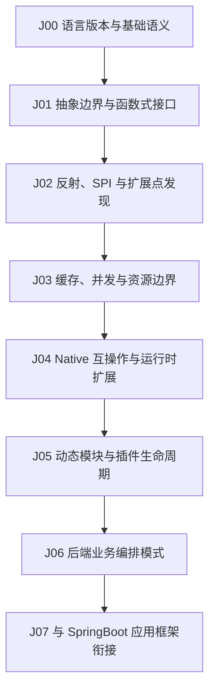

# Java

## 知识点入口

- 本模块先看宏观流程，再看文章：[知识地图](070101_知识地图.md)。
- Spring Boot 应用框架文章已迁入 [SpringBoot](../070105_SpringBoot/AGENTS.md)，本目录不再承载 Spring Boot 主线。
- `文章/` 只保留 Java 语言机制、通用后端模式和 Java 生态基础能力的原文锚点。

## 这个目录记录什么

这个文件是 Java 语言和通用后端机制的流程入口，不是 Spring Boot 文章池。

当前 Java 目录重点回答：

1. Java 语言机制如何影响后端代码边界。
2. 反射、函数式接口、SPI、Panama、动态模块等能力应该在哪些工程场景使用。
3. 缓存组合、Pipeline、动态模块这类通用模式如何迁移到后端系统。
4. 哪些文章只是技巧清单、框架宣传或案例包装，应降权处理。

## Java 机制流程

## 流程节点与当前文章

| 节点 | 这个节点要解决什么 | 当前文章锚点 | 处理策略 |
|---|---|---:|---|
| J00 语言版本与基础语义 | Java 8、语言特性、基础语义如何影响代码组织 | 1 | 基础教程默认略读，只吸收会影响设计判断的规则 |
| J01 抽象边界与函数式接口 | Function、lambda、组合式处理如何改善代码边界 | 2 | 避免把技巧清单写成架构准则，只保留可复用抽象判断 |
| J02 反射、SPI 与扩展点发现 | 反射工具、SPI 如何用于框架扩展和插件发现 | 2 | 重点记录权限、类型安全、可测试性和生命周期风险 |
| J03 缓存、并发与资源边界 | 本地缓存、分布式缓存如何组合，边界在哪里 | 2 | 缓存文章要看一致性、失效、容量和降级 |
| J04 Native 互操作与运行时扩展 | Panama 等原生互操作能力适合什么场景 | 1 | 标记为后续关注，不能直接迁移到业务系统 |
| J05 动态模块与插件生命周期 | Java 动态模块如何装配、隔离、卸载 | 1 | 与 Spring Boot 动态 jar 分开，保留语言/模块机制视角 |
| J06 后端业务编排模式 | Pipeline 如何拆复杂业务流程 | 1 | 作为通用业务编排模式沉淀，不绑定 Spring Boot |
| J07 与 SpringBoot 衔接 | Java 机制如何被 Spring Boot 应用框架使用 | 0 | 需要跨读 [SpringBoot](../070105_SpringBoot/AGENTS.md)，不要在 Java 目录重复沉淀 |

## 当前目录纠偏

| 原问题 | 处理 |
|---|---|
| Java 目录原先把 Spring Boot 当主线 | 已拆出 [SpringBoot](../070105_SpringBoot/AGENTS.md)，Spring Boot 文章统一迁走 |
| Spring Batch、Resilience4j、幂等、参数校验、动态 jar 等链接原本在 Java 入口里 | 这些文章现在由 SpringBoot 路线承接，Java 只保留机制层关系 |
| Java 文章中出现 Spring Boot 依赖或示例 | 如果文章主问题是 Java 机制，仍留 Java；如果主问题是 Spring Boot 应用装配，迁入 SpringBoot |

## 新文章路由速查

| 文章主问题 | 优先节点 | 先判断 |
|---|---|---|
| Java 版本、基础语法、新特性 | J00 | 是否只是基础教程，还是影响设计边界 |
| Function、lambda、Stream、接口抽象 | J01 | 是否能减少分支、提升组合和测试性 |
| Reflection、SPI、注解扫描 | J02 | 是否有类型安全、权限、性能和生命周期风险 |
| Caffeine、Guava、Redis、本地缓存组合 | J03 | 是否说明一致性、失效、容量和回源策略 |
| Panama、JNI、原生库 | J04 | 是否有真实性能/能力边界和部署成本 |
| Celix、OSGi、动态模块 | J05 | 是否说明隔离、卸载、依赖和状态管理 |
| Pipeline、责任链、复杂流程拆分 | J06 | 是否能抽象成业务编排准则 |
| Controller、Bean Validation、Starter、Spring Batch、Resilience4j | 转 [SpringBoot](../070105_SpringBoot/AGENTS.md) | 主问题是应用框架，不是 Java 语言机制 |

## 当前明显缺口

| 流程节点 | 缺什么 | 为什么重要 |
|---|---|---|
| J02 | SPI 与 Java Module System、ServiceLoader 的对比 | 扩展机制不能只靠框架习惯判断 |
| J03 | 缓存一致性、失效策略和容量指标 | 当前文章偏技巧，缺生产失败模式 |
| J04 | Panama 与 JNI/JNA 的横向对标 | 原生互操作风险高，不能只看演示 |
| J05 | 动态模块卸载和状态清理 | 插件化最容易在生命周期和资源释放上出问题 |
| J06 | Pipeline 与责任链、状态机、工作流的边界 | 复杂流程拆分需要对标相邻模式 |

## 2026-06-18 来源校准

- 从 `99_人工筛查/07_工程与架构` 拉回来源：4 篇。
- 本轮核心入口：[Java来源校准与降权准则](070101_核心知识点/Java来源校准与降权准则.md)。
- 本轮知识地图入口：[070101_Java知识地图](070101_知识地图.md)。
- 处理口径：保留文章必须同时有 `已吸收至` 反向链接，并被核心知识点或知识地图引用；标题党、版本资讯、工具清单只作为降权或补证来源。
