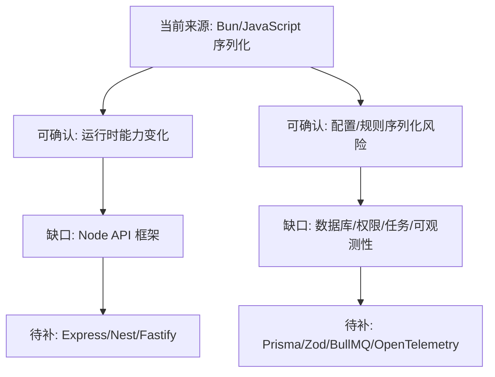

# Node 架构实现路线

## 知识点本体

当前来源没有真正覆盖 Node 框架，因此这个知识点先做“边界沉淀”：说明从现有 Bun 运行时、JavaScript 序列化和 AI 调试输出文章里能吸收什么，以及为什么不能据此推断完整 Node 架构。

## 来源贡献

| 来源 | 贡献类型 | 贡献内容 | 处理 |
|---|---|---|---|
| [Bun v1.3.14](<../文章/done-Bun v1.3.14 深度解析：Image API、HTTP_3、全局虚拟存储与五十项变革.md>) | 运行时能力边界 | Image API、HTTP/3、虚拟存储、进程和文件监听 | 只能说明 Bun 运行时能力变化，不等于 Node/Bun 业务后端架构 |
| [如何 Stringify 和 Parse 带函数的 JavaScript 对象](<../文章/done-如何 Stringify 和 Parse 带函数的 JavaScript 对象.md>) | 序列化边界 | JSON.stringify 会丢函数，replacer/reviver 可定制，但 eval 有风险 | 可用于理解配置持久化风险，不应直接作为后端方案 |
| [Bun AI 调试输出](<../文章/done-尤雨溪直呼很好！Bun 新功能引爆 AI 调试革命，Node.js 大佬连夜复刻！.md>) | 诊断输出边界 | 面向 AI 的错误、性能和调试输出 | 可作为后续“机器可读诊断”线索，不能替代日志/Trace 规范 |

## 当前能吸收什么

| 可吸收点 | 对 Node 理解的作用 |
|---|---|
| Bun 的运行时能力变化很快 | 运行时发布资讯只能作为能力边界线索，不能直接变成后端架构准则 |
| TypeScript 提供编译期类型 | 后端仍需要运行时校验，不能把 TypeScript 类型当成请求数据可信证明 |
| JavaScript 对象序列化有函数丢失问题 | 持久化配置/图表/规则时，应优先设计数据化 DSL，而不是保存函数再 eval |
| AI 友好输出会改变调试流程 | 运行时和工具输出应更结构化，但生产诊断仍要有日志字段、Trace 和可复现证据 |

## 不能吸收什么

| 不能下结论 | 原因 |
|---|---|
| Node 应该选 Express/Nest/Koa/Fastify 哪个 | 当前来源没有这些内容 |
| Node 如何分层 Controller/Service/Repository | 当前来源没有服务端项目结构 |
| Node 如何做数据库访问和事务 | 当前来源没有 Prisma/TypeORM/Drizzle 或数据库文章 |
| Node 如何做认证授权、限流、任务队列、日志追踪 | 当前来源没有覆盖 |

## 认知校准点

| 校准点 | 说明 | 处理 |
|---|---|---|
| Bun 发布资讯不等于 Node 架构 | 它更多说明运行时能力变化，不能替代业务后端分层 | 后续需要补 Express/Nest/Fastify 等来源 |
| TypeScript 类型不是运行时校验 | 外部请求进入服务端后仍是未知输入 | 后续应补 Zod/class-validator 等运行时校验来源 |
| `eval` 解析函数字符串风险高 | 对象持久化文章为了图表配置给出方案，但后端使用要考虑安全 | 更推荐设计 DSL 或白名单表达式 |
| 面向 AI 的诊断输出不是可观测体系 | AI 可读输出能辅助调试，但仍要回到日志字段、Trace、指标和复现步骤 | 不把它当生产观测结论 |

## 低置信路线图

## 下次补 Node 文章时先问

| 问题 | 用来判断什么 |
|---|---|
| 它是运行时能力、页面渲染框架，还是业务 API 后端？ | 避免把 Bun/Next/Nuxt 误当完整后端架构 |
| 它有没有运行时输入校验？ | 判断 TypeScript 类型是否落到请求边界 |
| 它的数据访问层怎么组织？ | 判断是否有事务、连接池、迁移和模型边界 |
| 它如何处理后台任务和长耗时任务？ | 判断是否适合生产业务后端 |
| 它如何做日志、Trace、限流、鉴权？ | 判断是否具备后端工程化能力 |
