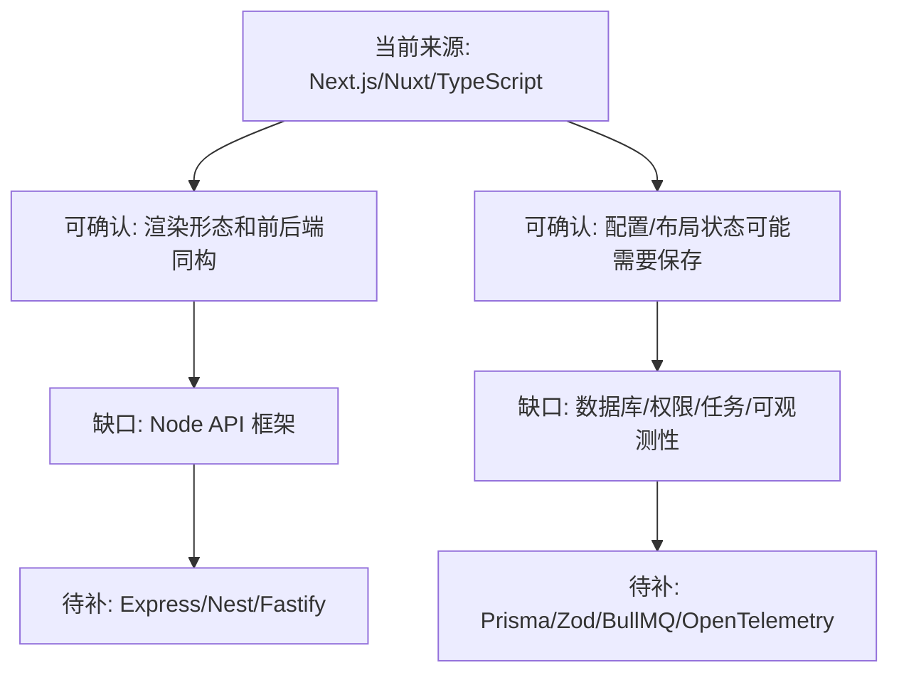

# Node 架构实现路线

## 知识点本体

当前来源没有真正覆盖 Node 框架，因此这个知识点先做“边界沉淀”：说明从现有 JavaScript/TypeScript/Next.js/Nuxt 文章里能吸收什么，以及为什么不能据此推断完整 Node 架构。

## 来源贡献

| 来源 | 贡献类型 | 贡献内容 | 处理 |
|---|---|---|---|
| [编程菜鸟挑战60天掌握Javascript/Typescript/Next.js day 20](<../文章/编程菜鸟挑战60天掌握Javascript_Typescript_Next.js day 20.md>) | 前后端同构边界 | CDN、静态生成、构建、预渲染、SSR、客户端渲染 | 只能说明 Next.js 渲染和部署形态，不等于 Node 架构 |
| [Spring AI + Vue 3 + Nuxt 4 实战](<../文章/Spring AI + Vue 3 + Nuxt 4 实战：从零打造企业级智能问卷系统.md>) | 前端工程边界 | Nuxt SSR、TypeScript、Vite、Monorepo、微前端 | 主要是前端/全栈项目结构，不是 Node 服务端实现 |
| [如何 Stringify 和 Parse 带函数的 JavaScript 对象](<../文章/如何 Stringify 和 Parse 带函数的 JavaScript 对象.md>) | 序列化边界 | JSON.stringify 会丢函数，replacer/reviver 可定制，但 eval 有风险 | 可用于理解配置持久化风险，不应直接作为后端方案 |
| [Gridstack.js](<../文章/Gridstack.js，一款神奇的 JavaScript 开源网格布局库？构建交互式的仪表板就是这么简单！.md>) | 前端交互 | 仪表板布局、动态添加移除、事件监听 | 不属于后端架构，只能说明前端状态可能需要后端保存布局 |

## 当前能吸收什么

| 可吸收点 | 对 Node 理解的作用 |
|---|---|
| Next.js 有静态生成、服务端渲染、客户端渲染三种页面生成思路 | Node 生态常把渲染层和服务端入口放在一起，需要区分“页面服务”和“业务后端” |
| TypeScript 提供编译期类型 | 后端仍需要运行时校验，不能把 TypeScript 类型当成请求数据可信证明 |
| JavaScript 对象序列化有函数丢失问题 | 持久化配置/图表/规则时，应优先设计数据化 DSL，而不是保存函数再 eval |
| Gridstack 这类前端状态需要保存布局 | Node 可能承担配置保存和用户布局状态服务，但当前来源没有 API 设计 |

## 不能吸收什么

| 不能下结论 | 原因 |
|---|---|
| Node 应该选 Express/Nest/Koa/Fastify 哪个 | 当前来源没有这些内容 |
| Node 如何分层 Controller/Service/Repository | 当前来源没有服务端项目结构 |
| Node 如何做数据库访问和事务 | 当前来源没有 Prisma/TypeORM/Drizzle 或数据库文章 |
| Node 如何做认证授权、限流、任务队列、日志追踪 | 当前来源没有覆盖 |

## 认知校准点

| 校准点 | 说明 | 处理 |
|---|---|---|
| Next.js/Nuxt 不等于 Node 架构 | 它们更多是渲染/全栈框架，不能替代业务后端分层 | 后续需要补 Express/Nest/Fastify 等来源 |
| TypeScript 类型不是运行时校验 | 外部请求进入服务端后仍是未知输入 | 后续应补 Zod/class-validator 等运行时校验来源 |
| `eval` 解析函数字符串风险高 | 对象持久化文章为了图表配置给出方案，但后端使用要考虑安全 | 更推荐设计 DSL 或白名单表达式 |
| 前端布局状态不是后端架构主体 | Gridstack 只说明可能有布局保存需求 | 不把它当 Node 知识点主体 |

## 低置信路线图

## 下次补 Node 文章时先问

| 问题 | 用来判断什么 |
|---|---|
| 它是页面渲染框架，还是业务 API 后端？ | 避免把 Next/Nuxt 误当完整后端架构 |
| 它有没有运行时输入校验？ | 判断 TypeScript 类型是否落到请求边界 |
| 它的数据访问层怎么组织？ | 判断是否有事务、连接池、迁移和模型边界 |
| 它如何处理后台任务和长耗时任务？ | 判断是否适合生产业务后端 |
| 它如何做日志、Trace、限流、鉴权？ | 判断是否具备后端工程化能力 |
