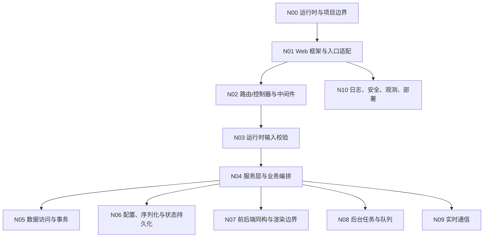

# Node
## 知识点入口

- 本模块先看宏观流程，再看文章：[知识地图](070102_核心知识点/知识地图.md)。
- 新文章必须先归入流程节点，再判断是补充、冲突、不同层次还是降权。
- `文章/` 只保留原文锚点，长期知识必须沉淀到 `070102_核心知识点/`。

## 这个目录记录什么

这个文件是 Node 应用的流程入口。

当前来源还不能支撑完整 Node 服务端架构。这里先建立 Node 应有的流程节点，并把已有 JavaScript/TypeScript/Next.js/Nuxt/序列化/前端状态文章放到对应节点做边界对比。

原则：

1. 先有 Node 应用流程节点。
2. 现有文章只能说明某些节点的边界，不能替代完整 Node 服务端架构。
3. 新文章来了，先判断它优化哪个节点。
4. 有价值就更新对应核心知识点；没有对应节点就先优化 AGENTS 流程。
5. 文章文件放在本目录 [文章](文章) 下，不再引用外部文章目录。

## Node 应用流程

## 流程节点与核心知识点

| 节点 | 这个节点要解决什么 | 对应核心知识点 | 当前沉淀 |
|---|---|---|---|
| N00 运行时与项目边界 | Node 是业务 API 后端、BFF、SSR 服务，还是前端构建/渲染运行时 | [Node架构实现路线.md](070102_核心知识点/Node架构实现路线.md) | 当前来源只能说明 Next/Nuxt 渲染边界 |
| N01 Web 框架与入口适配 | Express、Koa、Fastify、NestJS 怎么选，入口怎么组织 | [Node架构实现路线.md](070102_核心知识点/Node架构实现路线.md) | 当前缺来源 |
| N02 路由/控制器与中间件 | 路由、Controller、Middleware、异常处理怎么分工 | [Node架构实现路线.md](070102_核心知识点/Node架构实现路线.md) | 当前缺来源 |
| N03 运行时输入校验 | TypeScript 编译期类型之外，Zod/class-validator/TypeBox 怎么校验外部输入 | [Node架构实现路线.md](070102_核心知识点/Node架构实现路线.md) | 当前只有“TypeScript 不能替代运行时校验”的校准 |
| N04 服务层与业务编排 | service/usecase 如何组织业务流程 | [Node架构实现路线.md](070102_核心知识点/Node架构实现路线.md) | 当前缺来源 |
| N05 数据访问与事务 | Prisma、TypeORM、Drizzle、连接池、迁移、事务怎么处理 | [Node架构实现路线.md](070102_核心知识点/Node架构实现路线.md) | 当前缺来源 |
| N06 配置、序列化与状态持久化 | 配置、规则、布局状态如何安全序列化和保存 | [Node架构实现路线.md](070102_核心知识点/Node架构实现路线.md) | JavaScript 对象序列化文章补了函数丢失和 `eval` 风险 |
| N07 前后端同构与渲染边界 | Next/Nuxt 的 SSG、SSR、CSR、BFF 与业务后端如何区分 | [Node架构实现路线.md](070102_核心知识点/Node架构实现路线.md) | Next/Nuxt 文章只能说明渲染和全栈边界 |
| N08 后台任务与队列 | BullMQ、Agenda、Temporal、任务重试和状态怎么处理 | 暂无稳定核心知识点 | 当前缺来源 |
| N09 实时通信 | WebSocket、Socket.IO、SSE、房间、重连、广播怎么做 | 暂无稳定核心知识点 | 当前缺来源 |
| N10 日志、安全、观测、部署 | pino/winston、OpenTelemetry、鉴权、限流、PM2、容器化怎么治理 | 暂无稳定核心知识点 | 当前缺来源 |

## 流程节点上的现有对比结论

| 流程节点 | 原有沉淀 | 文章带来的对比 | 处理结果 | 来源锚点 |
|---|---|---|---|---|
| N00 运行时与项目边界 | Node 边界不清，容易把前端框架当业务后端 | Next.js 学习文章说明 SSG、SSR、CSR、构建和渲染形态；它只说明 Node 运行时可承载页面服务，不等于完整业务后端 | 写入边界校准 | [Next.js day 20](<文章/编程菜鸟挑战60天掌握Javascript_Typescript_Next.js day 20.md>) |
| N07 前后端同构与渲染边界 | Nuxt/Next 可能被误当服务端架构 | Nuxt 项目文章主要是前端/全栈项目结构、TypeScript、Vite、Monorepo、微前端；不能据此推断 Node API 分层 | 降权为渲染/全栈边界 | [Spring AI + Vue 3 + Nuxt 4 实战](<文章/Spring AI + Vue 3 + Nuxt 4 实战：从零打造企业级智能问卷系统.md>) |
| N06 配置、序列化与状态持久化 | 后端可能需要保存配置、规则或前端状态 | 对象序列化文章补充 `JSON.stringify` 会丢函数，replacer/reviver 可定制，但 `eval` 风险高；和后端安全要求冲突 | 写入序列化风险，推荐 DSL 或白名单表达式 | [如何 Stringify 和 Parse 带函数的 JavaScript 对象](<文章/如何 Stringify 和 Parse 带函数的 JavaScript 对象.md>) |
| N06 配置、序列化与状态持久化 | 前端布局状态可能需要后端保存 | Gridstack 文章说明前端布局、动态添加移除和事件监听；它不是后端架构，只能提示后端可能需要保存用户布局状态 | 降权为状态保存需求 | [Gridstack.js](<文章/Gridstack.js，一款神奇的 JavaScript 开源网格布局库？构建交互式的仪表板就是这么简单！.md>) |

## 新文章进入时的处理流程

| 顺序 | 动作 | 要回答的问题 | 结果 |
|---|---|---|---|
| 1 | 判断文章主问题 | 它优化的是 N00-N10 哪个流程节点？ | 得到目标节点 |
| 2 | 读取目标节点 | AGENTS 中该节点已有沉淀是什么？ | 得到已有判断 |
| 3 | 读取核心知识点 | `Node架构实现路线.md` 里已有内容是什么？ | 得到可对比对象 |
| 4 | 对比文章内容 | 是补充、冲突、不同层次，还是更好的方式？ | 得到处理类型 |
| 5 | 更新知识点正文 | 有价值就更新节点和路线；节点不够表达就先优化 AGENTS 流程 | 完成沉淀 |
| 6 | 保留来源锚点 | 只保留本目录 `文章/` 下的来源链接 | 不生成独立来源汇总文件 |

## 新文章路由速查

| 文章主问题 | 优先路由节点 | 先读核心知识点 |
|---|---|---|
| Node 运行时、SSR、BFF、全栈边界 | N00、N07 | Node 架构实现路线 |
| Express、Koa、Fastify、NestJS | N01、N02 | Node 架构实现路线 |
| Zod、class-validator、TypeBox | N03 | Node 架构实现路线 |
| Service、UseCase、业务分层 | N04 | Node 架构实现路线 |
| Prisma、TypeORM、Drizzle、事务 | N05 | Node 架构实现路线 |
| 配置、序列化、规则、布局状态 | N06 | Node 架构实现路线 |
| BullMQ、Agenda、Temporal | N08 | 当前缺核心知识点，应先补节点内容 |
| WebSocket、Socket.IO、SSE | N09 | 当前缺核心知识点，应先补节点内容 |
| 日志、安全、观测、部署 | N10 | 当前缺核心知识点，应先补节点内容 |

## 当前明显缺口

| 流程节点 | 缺什么 | 为什么重要 |
|---|---|---|
| N01-N02 Web 框架与入口适配 | Express、Koa、Fastify、NestJS 项目结构 | 没有它就不能指导 Node API 怎么写 |
| N03 运行时输入校验 | Zod、class-validator、TypeBox | TypeScript 类型不能保护外部请求 |
| N05 数据访问与事务 | Prisma、TypeORM、Drizzle、迁移、事务 | 当前不能指导真实业务写入 |
| N08-N10 后台任务、实时通信、治理部署 | BullMQ、Socket.IO、pino、OpenTelemetry、PM2、容器化 | 当前不能支撑生产后端 |
