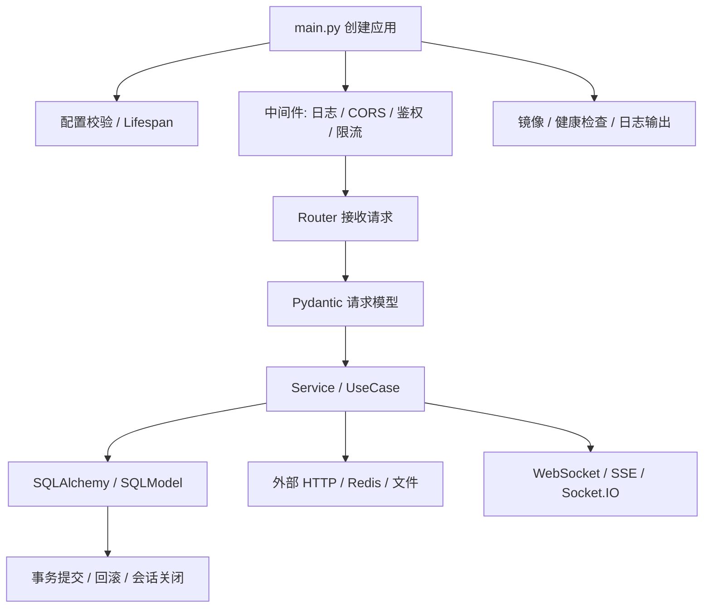

# FastAPI 生产边界与降权准则

## 来源

- [FastAPI 项目架构指南](../文章/done-FastAPI 项目架构指南.md)
- [FastAPI 架构指南](../文章/done-FastAPI 架构指南：用这份模版打造可扩展又安全的系统（附实战经验）.md)
- [FastAPI + SQLAlchemy 2.0 通用 CRUD](<../文章/done-FastAPI + SQLAlchemy 2.0 通用CRUD操作手册 —— 从同步到异步，一次讲透.md>)
- [Pydantic 高级用法](../文章/done-FastAPI中Pydantic数据验证高级用法与最佳实践.md)
- [SQLModel 统一 Pydantic 与 SQLAlchemy](../文章/done-告别重复定义：SQLModel 如何统一 Pydantic 与 SQLAlchemy.md)
- [FastAPI 性能优化技巧](../文章/done-10个FastAPI性能优化技巧，让你的API飞起来！.md)
- [FastAPI WebSocket vs Socket.IO](<../文章/done-FastAPI实战：WebSocket vs Socket.IO，这回真给我整明白了！.md>)
- [FastAPI 基础镜像](../文章/done-通用的 FastAPI 基础镜像到底该怎么构建并共享.md)

## 核心问题

FastAPI 文章数量很多，但大部分是教程和清单。长期知识应该回答：一个 Python API 服务如何划清路由、模型、事务、异步、认证、缓存、实时通道和部署边界。

## 判断准则

| 环节 | 稳定准则 |
|---|---|
| 项目结构 | 路由、服务层、数据访问、配置、中间件、异常处理要分开；目录模板不是目的，职责边界才是目的 |
| 请求模型 | Pydantic 负责外部输入形态和局部约束，跨资源、跨状态的业务规则仍放服务层或领域层 |
| ORM 模型 | SQLModel 可以减少重复定义，但核心系统要警惕请求模型、领域模型和持久化模型边界混淆 |
| SQLAlchemy 会话 | 会话生命周期、提交、回滚和关闭是稳定性核心；异步 Session 和同步驱动不能混用 |
| 异步性能 | async 只有在数据库、外部 HTTP、缓存等 I/O 链路一致异步时才可能收益明显 |
| 中间件 | 日志、耗时、鉴权、限流、黑名单等应有顺序和失败语义，不能堆在示例代码里 |
| 实时通信 | 原生 WebSocket 轻，Socket.IO 提供重连、心跳、房间等工程能力；先看产品连接要求 |
| 部署镜像 | 基础镜像统一环境，不替代健康检查、配置校验、日志、资源限制和回滚 |

## 降权规则

| 文章类型 | 处理 |
|---|---|
| “5 分钟上手”“入门到精通” | 只保留入口链路，不重复沉淀基础概念 |
| 第三方库清单 | 除非说明选型边界、失败模式和替代方案，否则不写核心知识点 |
| 性能提升口号 | 没有压测环境、指标、基线和副作用时，只作为候选线索 |
| Python 一行技巧、脚本自动化 | 不属于后端架构主线，按工具或低价值处理 |
| 数据分析库、Excel、TTS、数据清洗 | 已按技术本体迁出到数据分析、电脑工具、多模态或机器学习目录 |

## FastAPI 生产链路

## 待验证缺口

- FastAPI 权限模型、OAuth2 Scopes、FastAPI-Users 的生产边界需要单独沉淀。
- 缺少后台任务队列、可观测性和灰度发布资料。
- 性能优化需要真实压测、事件循环阻塞信号和连接池指标。
