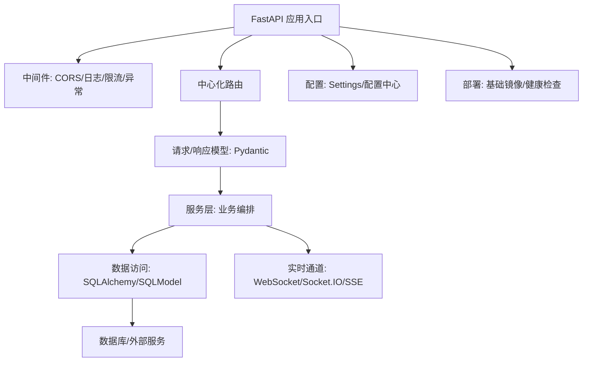

# Python 架构实现路线

## 知识点本体

Python 当前主要以 FastAPI 技术栈沉淀。它的架构路线不是“写几个接口”，而是：

```text
入口应用
  -> 路由分组
  -> 请求/响应模型
  -> 依赖注入
  -> 服务层
  -> 数据访问层
  -> 中间件/安全/日志
  -> 实时通信或后台能力
  -> 镜像与部署
```

## 来源贡献

| 来源 | 贡献类型 | 贡献内容 |
|---|---|---|
| [FastAPI 项目架构指南](<../文章/done-FastAPI 项目架构指南.md>) | 架构基线 | 中心化路由、日志、主入口、中间件、配置、依赖、路由与服务分离 |
| [FastAPI + SQLAlchemy 2.0 通用CRUD操作手册](<../文章/done-FastAPI + SQLAlchemy 2.0 通用CRUD操作手册 —— 从同步到异步，一次讲透.md>) | 数据访问 | SQLAlchemy 2.0、同步/异步引擎、连接池、事务、懒加载坑、连接池耗尽 |
| [FastAPI中Pydantic数据验证高级用法与最佳实践](../文章/done-FastAPI中Pydantic数据验证高级用法与最佳实践.md) | 请求校验 | Field、字段校验、模型校验、请求体约束，把脏数据拦在业务层之前 |
| [FastAPI实战：WebSocket vs Socket.IO](<../文章/done-FastAPI实战：WebSocket vs Socket.IO，这回真给我整明白了！.md>) | 实时通信 | 原生 WebSocket 与 Socket.IO 的边界：轻量协议 vs 带重连/心跳/房间的封装 |
| [告别重复定义：SQLModel 如何统一 Pydantic 与 SQLAlchemy](<../文章/done-告别重复定义：SQLModel 如何统一 Pydantic 与 SQLAlchemy.md>) | 模型复用 | 用同一套模型减少接口模型和 ORM 模型重复，但要警惕边界混淆 |
| [用 FastAPI + Pydantic 打造配置中心](<../文章/done-用 FastAPI + Pydantic 打造“可验证、可热载、可覆盖”的配置中心.md>) | 配置能力 | 配置要可验证、可覆盖、可热载，而不是散落在环境变量和字典里 |
| [通用的 FastAPI 基础镜像到底该怎么构建并共享](<../文章/done-通用的 FastAPI 基础镜像到底该怎么构建并共享.md>) | 部署 | 基础镜像可以统一运行环境，但不能替代应用级健康检查和发布策略 |

## 可吸收的架构判断

| 模块 | Python/FastAPI 的实现方式 | 你要吸收什么 |
|---|---|---|
| 应用入口 | `main.py` 创建应用，挂中间件、异常处理、路由 | 入口文件是安全、限流、跨域、日志和生命周期的集中点 |
| 路由组织 | `api_router.py` 统一 include 各业务路由 | 路由只做协议适配，业务逻辑应下沉到服务层 |
| 请求校验 | Pydantic 模型、Field、field_validator、model_validator | Python 靠运行时模型校验保证输入质量，不能只依赖类型提示 |
| 配置管理 | Pydantic Settings / 配置中心 | 配置应启动时验证，缺必填配置要尽早失败 |
| 数据访问 | SQLAlchemy 2.0、Session 依赖注入、显式事务 | 数据库会话生命周期是 FastAPI 后端稳定性的核心 |
| 同步/异步 | 同步和异步都可用，但不能混用驱动和 Session | 异步不是自动更快，只有高并发 I/O 链路全异步才有价值 |
| 实时通信 | WebSocket、Socket.IO、SSE | 原生 WebSocket 轻，但重连/心跳/房间要自己做；Socket.IO 重但工程能力完整 |
| 部署 | 基础镜像、依赖固定、运行命令 | 镜像统一环境只是底座，仍需健康检查、日志、配置、资源限制 |

## 认知校准点

| 校准点 | 说明 | 处理 |
|---|---|---|
| FastAPI 项目结构文章容易变成模板崇拜 | 目录结构不是目的，职责边界才是目的 | 只吸收路由、服务、模型、依赖、配置、中间件的分工 |
| 异步不会自动提升性能 | 如果数据库驱动、外部调用、任务队列不是全异步，收益有限还会增加复杂度 | 选同步/异步时先看并发模型和团队熟悉度 |
| Pydantic 不是业务规则全部 | 它适合输入格式和局部规则，跨资源、跨状态的业务规则仍应在服务/领域层 | 不把校验模型当领域模型的全部 |
| 实时通信不是只选 WebSocket | 产品端复杂网络、自动重连、房间广播会改变选型 | 先定义连接稳定性要求，再选 WebSocket/Socket.IO/SSE |

## Python 实现路线图



## 下次读 Python 文章时先问

| 问题 | 用来判断什么 |
|---|---|
| 它是在讲项目结构，还是职责边界？ | 防止被模板目录迷惑 |
| 请求模型和数据库模型是否混在一起？ | 判断可维护性和边界污染 |
| 数据库会话怎么创建、提交、回滚和关闭？ | 判断是否会连接池耗尽 |
| 同步/异步链路是否一致？ | 判断是否会 MissingGreenlet、阻塞事件循环或混用 Session |
| 实时通信有没有重连、心跳、鉴权和清理？ | 判断是否可生产使用 |

## 已知缺口

- 缺少 Celery/RQ/Arq 等后台任务来源。
- 缺少 OpenTelemetry、Prometheus、日志聚合等可观测性来源。
- 缺少完整权限模型和多租户来源。
- 缺少真实线上压测、容量规划、发布回滚来源。
