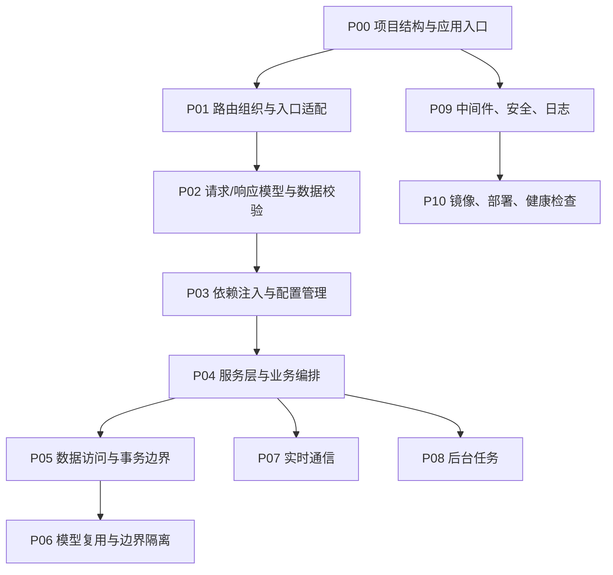

# Python
## 知识点入口

- 本模块先看宏观流程，再看文章：[知识地图](070103_核心知识点/知识地图.md)。
- 新文章必须先归入流程节点，再判断是补充、冲突、不同层次还是降权。
- `文章/` 只保留原文锚点，长期知识必须沉淀到 `070103_核心知识点/`。

## 这个目录记录什么

这个文件是 Python 应用的流程入口。

当前主线是 FastAPI 生态。目标不是保存 FastAPI 文章列表，而是建立一条 Python 服务从开发到运行的主流程：

1. 先定义 Python 应用流程节点。
2. 每个核心知识点挂到流程节点上。
3. 新文章来了，先判断它优化哪个节点。
4. 再和该节点已有沉淀对比：补充、冲突、不同层次、更好的方式或低价值。
5. 最后只更新对应流程节点和核心知识点；文章文件放在本目录 [文章](文章) 下，不再引用外部文章目录。

## Python 应用流程

## 流程节点与核心知识点

| 节点 | 这个节点要解决什么 | 对应核心知识点 | 当前沉淀 |
|---|---|---|---|
| P00 项目结构与应用入口 | `main.py`、应用创建、中间件、路由挂载、日志和生命周期怎么组织 | [Python架构实现路线.md](070103_核心知识点/Python架构实现路线.md) | FastAPI 项目架构文章补了主入口、中心化路由、日志和中间件 |
| P01 路由组织与入口适配 | API 路由如何分组，路由层和服务层如何分工 | [Python架构实现路线.md](070103_核心知识点/Python架构实现路线.md) | 路由只做协议适配，业务逻辑下沉服务层 |
| P02 请求/响应模型与数据校验 | Pydantic 模型、Field、字段校验、模型校验怎么拦住脏数据 | [Python架构实现路线.md](070103_核心知识点/Python架构实现路线.md) | Pydantic 文章补了运行时校验边界 |
| P03 依赖注入与配置管理 | `Depends`、数据库会话、配置读取、启动时校验、热载和覆盖怎么做 | [Python架构实现路线.md](070103_核心知识点/Python架构实现路线.md) | 配置中心文章补了可验证、可覆盖、可热载配置 |
| P04 服务层与业务编排 | 路由调用服务，服务编排业务和外部依赖 | [Python架构实现路线.md](070103_核心知识点/Python架构实现路线.md) | 当前只有分层准则，缺复杂领域建模案例 |
| P05 数据访问与事务边界 | SQLAlchemy 2.0 同步/异步引擎、Session 生命周期、事务、连接池怎么管理 | [Python架构实现路线.md](070103_核心知识点/Python架构实现路线.md) | SQLAlchemy 文章补了同步/异步边界、连接池和事务风险 |
| P06 模型复用与边界隔离 | Pydantic、SQLAlchemy、SQLModel 是否合并，什么时候分开 | [Python架构实现路线.md](070103_核心知识点/Python架构实现路线.md) | SQLModel 文章补了减少重复和边界混淆的取舍 |
| P07 实时通信 | WebSocket、Socket.IO、SSE 怎么选，连接、重连、心跳、房间怎么处理 | [Python架构实现路线.md](070103_核心知识点/Python架构实现路线.md) | WebSocket vs Socket.IO 文章补了轻量协议和工程封装边界 |
| P08 后台任务 | Celery、RQ、Arq、任务重试、任务状态怎么设计 | 暂无稳定核心知识点 | 当前缺来源 |
| P09 中间件、安全、日志 | CORS、鉴权、异常处理、日志、限流、Trace 怎么进入应用入口 | [Python架构实现路线.md](070103_核心知识点/Python架构实现路线.md) | 当前只零散覆盖日志和中间件，缺完整安全和可观测性 |
| P10 镜像、部署、健康检查 | 基础镜像、依赖固定、启动命令、健康检查、资源限制和发布策略 | [Python架构实现路线.md](070103_核心知识点/Python架构实现路线.md) | 基础镜像文章补了运行环境统一，但不能替代应用级健康检查 |

## 流程节点上的现有对比结论

| 流程节点 | 原有沉淀 | 文章带来的对比 | 处理结果 | 来源锚点 |
|---|---|---|---|---|
| P00 项目结构与应用入口 | 需要 FastAPI 项目结构，但容易变成模板崇拜 | 项目架构文章把主入口、中心化路由、日志、中间件、配置放到一条启动链路里；不是照抄目录，而是明确职责边界 | 写入应用入口和路由组织 | [FastAPI 项目架构指南](<文章/FastAPI 项目架构指南.md>) |
| P02 请求/响应模型与数据校验 | Python 类型提示不能保证外部请求可信 | Pydantic 文章补齐 Field、字段校验、模型校验、请求体约束；校准“Pydantic 不是全部业务规则” | 写入请求校验节点 | [FastAPI中Pydantic数据验证高级用法与最佳实践](文章/FastAPI中Pydantic数据验证高级用法与最佳实践.md) |
| P03 依赖注入与配置管理 | 配置不能散落在字典和环境变量里 | 配置中心文章补齐配置启动校验、覆盖、热载；比简单 `.env` 更适合可治理配置 | 写入配置管理节点 | [用 FastAPI + Pydantic 打造配置中心](<文章/用 FastAPI + Pydantic 打造“可验证、可热载、可覆盖”的配置中心.md>) |
| P05 数据访问与事务边界 | 需要区分路由、服务和数据库访问 | SQLAlchemy 2.0 文章补齐同步/异步引擎、Session 生命周期、连接池、事务、懒加载坑；校准“异步不会自动更快” | 写入数据访问节点 | [FastAPI + SQLAlchemy 2.0 通用CRUD操作手册](<文章/FastAPI + SQLAlchemy 2.0 通用CRUD操作手册 —— 从同步到异步，一次讲透.md>) |
| P06 模型复用与边界隔离 | 接口模型和 ORM 模型重复，但合并会污染边界 | SQLModel 文章补了减少重复的方式，也提醒模型边界可能被混淆 | 作为取舍写入模型复用节点 | [SQLModel 如何统一 Pydantic 与 SQLAlchemy](<文章/告别重复定义：SQLModel 如何统一 Pydantic 与 SQLAlchemy.md>) |
| P07 实时通信 | WebSocket 是实时通信入口，但生产能力不完整 | WebSocket vs Socket.IO 文章补齐重连、心跳、房间等工程能力差异；不是简单二选一 | 写入实时通信节点 | [FastAPI实战：WebSocket vs Socket.IO](<文章/FastAPI实战：WebSocket vs Socket.IO，这回真给我整明白了！.md>) |
| P10 镜像、部署、健康检查 | 基础镜像能统一环境，但不是完整部署方案 | 基础镜像文章补运行环境统一；和健康检查、发布回滚、资源限制不是同一层次 | 降权吸收为部署底座 | [通用的 FastAPI 基础镜像到底该怎么构建并共享](<文章/通用的 FastAPI 基础镜像到底该怎么构建并共享.md>) |

## 新文章进入时的处理流程

| 顺序 | 动作 | 要回答的问题 | 结果 |
|---|---|---|---|
| 1 | 判断文章主问题 | 它优化的是 P00-P10 哪个流程节点？ | 得到目标节点 |
| 2 | 读取目标节点 | AGENTS 中该节点已有沉淀是什么？ | 得到已有判断 |
| 3 | 读取核心知识点 | `Python架构实现路线.md` 里已有内容是什么？ | 得到可对比对象 |
| 4 | 对比文章内容 | 是补充、冲突、不同层次，还是更好的方式？ | 得到处理类型 |
| 5 | 更新知识点正文 | 有价值就更新节点和路线；节点不够表达就先优化 AGENTS 流程 | 完成沉淀 |
| 6 | 保留来源锚点 | 只保留本目录 `文章/` 下的来源链接 | 不生成独立来源汇总文件 |

## 新文章路由速查

| 文章主问题 | 优先路由节点 | 先读核心知识点 |
|---|---|---|
| FastAPI 项目结构、主入口、路由组织 | P00、P01 | Python 架构实现路线 |
| Pydantic、请求体验证、响应模型 | P02 | Python 架构实现路线 |
| Depends、Settings、配置中心、热载 | P03 | Python 架构实现路线 |
| 服务层、业务编排、领域规则 | P04 | Python 架构实现路线 |
| SQLAlchemy、SQLModel、事务、连接池 | P05、P06 | Python 架构实现路线 |
| WebSocket、Socket.IO、SSE | P07 | Python 架构实现路线 |
| Celery、RQ、Arq、后台任务 | P08 | 当前缺核心知识点，应先补节点内容 |
| CORS、鉴权、日志、Trace、限流 | P09 | Python 架构实现路线 |
| Docker、基础镜像、健康检查、发布 | P10 | Python 架构实现路线 |

## 当前明显缺口

| 流程节点 | 缺什么 | 为什么重要 |
|---|---|---|
| P04 服务层与业务编排 | 复杂业务分层、领域模型、跨服务编排 | 当前只够支撑 FastAPI 应用结构，不够指导复杂业务系统 |
| P08 后台任务 | Celery/RQ/Arq、任务重试、任务状态、任务幂等 | Python 常需要异步任务和批处理 |
| P09 中间件、安全、日志 | OAuth2、RBAC、Trace、指标、日志聚合、告警 | 上线后可治理性不足 |
| P10 镜像、部署、健康检查 | Kubernetes、滚动发布、健康检查、回滚 | 基础镜像不能代表生产部署完整方案 |
