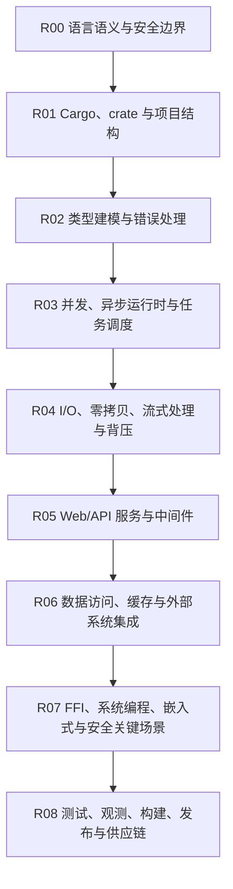

# Rust

## 知识点入口

- 本模块先看宏观流程，再看文章：[知识地图](070104_知识地图.md)。
- 新文章必须先判断 Rust 是否是技术本体；只因为工具“用 Rust 写成”不自动进入本目录。
- `文章/` 只保留 Rust 语言、Cargo 工程、运行时、系统集成和后端性能机制的原文锚点。

## 这个目录记录什么

这个文件是 Rust 作为后端与系统工程语言的流程入口，不是“所有标题里出现 Rust 的文章池”。

当前 Rust 目录重点回答：

1. Rust 的所有权、生命周期、类型系统如何影响工程边界。
2. Cargo、crate、workspace 如何组织服务和库。
3. Rust 在高性能 I/O、流式处理、零拷贝和背压控制中解决什么问题。
4. Rust 适合哪些后端、系统、嵌入式和安全关键场景，哪些场景只是生态资讯。
5. 用 Rust 实现的数据库、数据工具、文档工具，如果文章主问题不是 Rust 机制，应留在对应技术本体目录。

## Rust 工程流程

## 流程节点与当前文章

| 节点 | 这个节点要解决什么 | 当前文章锚点 | 处理策略 |
|---|---|---:|---|
| R00 语言语义与安全边界 | 所有权、借用、生命周期和内存安全如何影响架构边界 | 1 | 重点吸收可迁移的安全边界，不重复基础语法 |
| R01 Cargo、crate 与项目结构 | Cargo 核心概念、包结构、依赖和 workspace 如何支撑工程组织 | 1 | 抽出项目结构准则，后续对标 Maven、Python packaging、Node package 管理 |
| R04 I/O、零拷贝、流式处理与背压 | 大文件、流式处理、内存占用、吞吐和背压如何设计 | 1 | 重点吸收可验证的性能边界和失败模式 |
| R07 FFI、系统编程、嵌入式与安全关键场景 | Rust 在汽车等安全关键行业的采用边界和工程门槛 | 1 | 作为行业采用与安全边界线索，不能直接写成后端选型结论 |

## 当前目录纠偏

| 原问题 | 处理 |
|---|---|
| `0701_后端架构/文章` 根目录承载 Rust 文章 | 已迁入本目录 `文章/`，根目录不再作为长期文章入口 |
| 标题出现 Rust 但主问题是工具、数据库、数据平台或文档转换 | 不按关键词搬入本目录；按技术本体留在对应目录 |
| Rust 行业采用文章容易被误当技术实践 | 只作为安全关键场景和生态成熟度线索，正式沉淀前要补工程证据 |

## 新文章路由速查

| 文章主问题 | 优先节点 | 先判断 |
|---|---|---|
| 所有权、生命周期、借用检查、unsafe、安全边界 | R00 | 是否影响架构边界，而不是基础语法重复 |
| Cargo、crate、workspace、feature、依赖治理 | R01 | 是否能形成项目组织和供应链准则 |
| 类型建模、Result/Error、trait、泛型、宏 | R02 | 是否改善边界表达、错误传播和可测试性 |
| Tokio、async、并发任务、线程池、调度 | R03 | 是否说明背压、取消、超时、资源限制 |
| 大文件、网络 I/O、零拷贝、流式处理 | R04 | 是否有输入、输出、指标、基线和失败模式 |
| Axum、Actix、Rocket、Tower、中间件 | R05 | 是否支撑真实 Web/API 服务结构 |
| SQLx、SeaORM、Redis、消息队列、外部接口 | R06 | 是否讲清连接池、事务、一致性和资源边界 |
| FFI、WASM、嵌入式、汽车、系统工具 | R07 | 是否讲 Rust 机制或安全关键边界，而不是泛生态资讯 |
| 测试、观测、构建、镜像、发布、供应链 | R08 | 是否能沉淀生产化验证和回滚动作 |

## 跨域保留规则

| 情况 | 应放位置 | 理由 |
|---|---|---|
| Python 工具链使用 Rust 提升性能，如 UV、Ruff、Ty | `09_电脑工具/0901_开发工具与CLI` 或对应工具目录 | 主问题是 Python 工具链和开发工具，不是 Rust 工程机制 |
| 数据库、存储引擎、数据处理引擎用 Rust 实现 | 对应 `04_OLAP与数据库` 或 `03_数据工程与数仓` 技术目录 | 主问题是查询、存储、执行或数据链路 |
| 文档转换、命令行工具、本地工具用 Rust 实现 | `09_电脑工具` 对应目录 | 主问题是工具使用和自动化 |
| 文章重点讲 Rust 所有权、Cargo、Tokio、Axum、性能 I/O 或系统安全 | 本目录 | Rust 是技术本体，能沉淀语言和工程准则 |

## 当前明显缺口

| 流程节点 | 缺什么 | 为什么重要 |
|---|---|---|
| R02 | 类型建模、错误处理和 trait 边界 | Rust 的工程价值不只在性能，还在边界表达 |
| R03 | Tokio/async 的取消、超时、背压和资源限制 | 后端服务容易在异步任务泄漏和背压上出问题 |
| R05 | Axum/Actix 的真实服务结构 | 当前缺 Web/API 服务主线，不能指导生产后端 |
| R06 | 数据访问、连接池、事务和缓存集成 | 后端服务必须补外部系统边界 |
| R08 | 测试、观测、构建、发布和供应链 | Rust 工程化不能停在语言机制和性能技巧 |

## 2026-06-18 来源校准

- 从 `99_人工筛查/07_工程与架构` 拉回来源：4 篇。
- 本轮核心入口：[Rust工程边界与性能准则](070104_核心知识点/Rust工程边界与性能准则.md)。
- 本轮知识地图入口：[070104_Rust知识地图](070104_知识地图.md)。
- 处理口径：保留文章必须同时有 `已吸收至` 反向链接，并被核心知识点或知识地图引用；标题党、版本资讯、工具清单只作为降权或补证来源。
