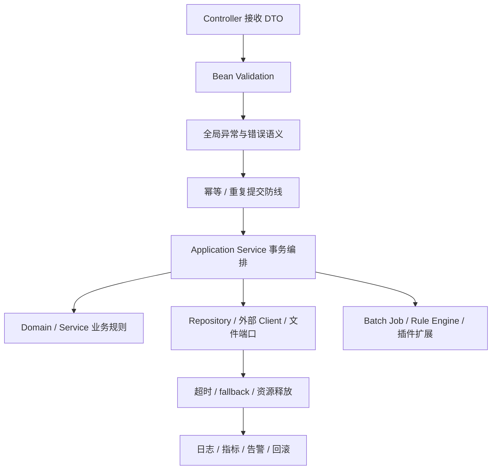

# SpringBoot 接口集成与运行治理边界

## 来源

- [Controller 层代码就该这么写](../文章/done-Controller层代码就该这么写，简洁又优雅！.md)
- [如何拥有一个优雅的 controller](../文章/done-如何拥有一个优雅的 controller.md)
- [参数校验](../文章/done-和 if else说再见，SpringBoot 这样做参数校验才足够优雅！.md)
- [接口幂等性](../文章/done-SpringBoot 实现接口幂等性的 4 种方案！.md)
- [外部接口调用方式](../文章/done-Spring Boot 调用外部接口的 3 种方式，还有谁不会？！.md)
- [Resilience4j TimeLimiter](../文章/done-SpringBoot整合Resilience4j，解决长时间等待第三方API迟迟不响应的问题.md)
- [Spring Batch](../文章/done-Spring Batch 批处理框架，真的太强悍了！！.md)
- [MinIO 分片上传](../文章/done-SpringBoot + minio实现分片上传、秒传、续传.md)
- [EasyExcel 导入导出](../文章/done-SpringBoot 集成 EasyExcel 3.x 优雅实现 Excel 导入导出.md)

## 核心问题

SpringBoot 文章混合了 Controller 写法、参数校验、幂等、外部 API、文件、Excel、批处理、规则引擎和性能优化。统一准则是：入口层管契约，应用层管事务和副作用，外部集成管资源生命周期，运行治理管超时、回滚和可观测信号。

## 判断准则

| 环节 | 准则 |
|---|---|
| Controller | 只做协议适配、参数校验、DTO 转 Command、Response 转换；不写业务规则和数据库访问 |
| 参数校验 | Bean Validation 管请求形态；业务状态、权限和跨资源约束不能塞进 DTO 注解 |
| 幂等 | 写接口先判断副作用类型，再选唯一键、乐观锁、Token、下游序列号或业务幂等表 |
| 外部接口 | RestTemplate/WebClient/Feign 的比较不是重点；重点是超时、重试、fallback、错误语义和资源释放 |
| 韧性治理 | TimeLimiter 只解决等待边界，不等于完整熔断、重试、隔离、限流方案 |
| 文件与 Excel | 要看文件大小、内存、分片、秒传、续传、错误行、事务和清理策略 |
| 批处理 | 导入、迁移、对账应进入 Job/Step/chunk/skip/JobRepository 模型，不要写成普通循环 |
| 性能优化 | “10 倍提升”没有环境、指标、基线和副作用时降权，只保留优化候选 |

## 入口到运行链路

## 认知偏差

| 常见错误认知 | 正确理解 |
|---|---|
| Controller 写得优雅就是架构好 | Controller 只是入口适配，核心要看业务和副作用是否下沉 |
| 参数校验能替代业务校验 | 参数校验只证明请求形态合法，不能证明业务状态允许 |
| 集成某个库就是生产能力 | 生产能力还需要容量、错误处理、事务、一致性、观测和回滚 |
| 规则引擎能消灭 if else | 规则引擎会引入版本、调试、审计、灰度和回滚成本 |

## 待验证缺口

- Spring Security、Actuator/Micrometer、Testcontainers 和部署回滚仍缺高质量来源。
- Resilience4j 的 CircuitBreaker、Retry、Bulkhead、RateLimiter 组合边界还未沉淀。
- 文件导入导出需要大文件、错误行、重试和事务边界的真实案例。
