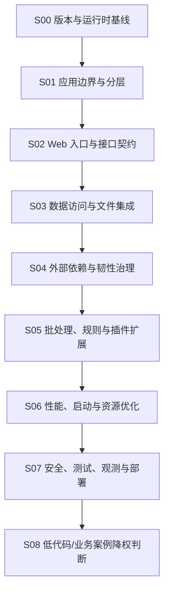

# SpringBoot

## 知识点入口

- 本模块先看宏观流程，再看文章：[知识地图](070105_知识地图.md)。
- 新文章必须先归入流程节点，再判断是补充、冲突、不同层次还是降权。
- `文章/` 只保留原文锚点，长期知识沉淀到 `070105_核心知识点/`。

## 技术定位

| 项 | 内容 |
|---|---|
| 技术名 | Spring Boot |
| 一级类目 | 工程与架构 |
| 二级类目 | 后端架构 |
| 技术本体 | Java 后端应用的自动配置、启动装配、Web/API、数据访问、集成能力和生产运行框架 |
| 全局架构位置 | Java 后端服务的应用框架层，承接 Java 语言机制，向上暴露业务 API、任务、批处理和集成服务 |
| 主要使用者 | 后端工程师、平台工程师 |
| 主要产出 | 可部署的 Java 服务、API、批处理作业、集成适配器、后台管理系统 |
| 当前证据状态 | 本地文章锚点已归集；官网、版本和基准数据后续精修时再补证 |

## 目录边界

| 放这里 | 不放这里 |
|---|---|
| Spring Boot 应用结构、自动配置、Starter、Controller、参数校验、幂等、外部接口、数据源、文件处理、批处理、规则引擎、动态插件、性能优化、版本迁移 | Java 语法、反射、函数式接口、Panama、SPI 等语言机制；这些留在 [Java](../070101_Java/AGENTS.md) |
| Spring 生态能力在 Spring Boot 应用中的落地，例如 Spring Batch、Resilience4j、HikariCP、EasyExcel、MinIO、Tika | 跨语言测试平台、接口契约治理、压测体系、安全权限和可观测性；这些进入 `0703_工程实践与质量保障` |
| 以 Spring Boot 为主体的低代码平台或业务案例 | 纯前端框架、查询优化、机器学习模型案例、数据分析方法、智能问数和调度编排平台 |

## Spring Boot 应用流程

## 流程节点与文章池

| 节点 | 这个节点要解决什么 | 当前文章锚点 | 处理策略 |
|---|---|---:|---|
| S00 版本与运行时基线 | Spring Boot 3/4、容器支持、JVM/Native Image、启动与兼容性怎么判断 | 2 | 版本资讯默认略读，只有影响迁移/部署边界才吸收 |
| S01 应用边界与分层 | 传统分层、六边形、DDD、低代码平台如何定位 | 2 | 优先抽分层准则，低代码平台作为案例降权 |
| S02 Web 入口与接口契约 | Controller、DTO、参数校验、幂等、外部 API 调用如何设计 | 3 | 只吸收能形成副作用边界、错误语义和验证动作的内容 |
| S03 数据访问与文件集成 | 连接池、Excel、对象存储、文档解析如何接入 | 4 | 区分框架集成教程和可复用工程边界 |
| S04 外部依赖与韧性治理 | 超时、fallback、慢第三方 API 和资源等待怎么治理 | 1 | Resilience4j 先吸收为时间边界，不替代完整熔断/限流/隔离 |
| S05 批处理、规则与插件扩展 | Spring Batch、LiteFlow、动态 jar 如何管理生命周期 | 3 | 重点看可重启、可追踪、可回滚和审计 |
| S06 性能、启动与资源优化 | 启动、连接池、缓存、异步、Native Image 等优化是否可靠 | 2 | 标题性能数字必须降权，要求基线、环境和指标 |
| S08 低代码/业务案例 | 低代码平台和业务例子是否值得沉淀 | 1 | 默认略读，只有形成架构边界或验证动作才精读 |

## 已沉淀核心知识点入口

当前 Spring Boot 目录承接文章锚点、流程路由和主题知识点。已有 Java 目录中与 Spring Boot 强相关的判断，后续精读时应迁移或重写到本目录，例如：

| 主题 | 当前状态 | 后续动作 |
|---|---|---|
| 参数校验与入口契约 | 已有来源锚点 | 抽成 Spring Boot 请求契约核心知识点 |
| 幂等与写入防线 | 已有来源锚点 | 抽成接口副作用与写入防线 |
| 六边形架构 | 已有来源锚点 | 抽成分层强度选择准则 |
| Resilience4j | 已有来源锚点 | 抽成外部依赖时间边界 |
| Spring Batch | 已有来源锚点 | 抽成批处理作业模型 |
| 动态 jar / LiteFlow | 已有来源锚点 | 抽成扩展点和插件生命周期 |
| 接口集成与运行治理 | [已沉淀](070105_核心知识点/SpringBoot接口集成与运行治理边界.md) | 后续补 Security、Actuator、Micrometer、Testcontainers |

## 新文章路由速查

| 文章主问题 | 优先节点 | 判断重点 |
|---|---|---|
| Spring Boot 版本、容器、启动、Native Image | S00、S06 | 是否影响迁移、启动、部署和运行成本 |
| 项目结构、DDD、六边形、低代码平台 | S01 | 是否形成分层和模块边界准则 |
| Controller、DTO、校验、幂等、外部接口 | S02、S04 | 是否说明输入输出、副作用、错误和重试语义 |
| 数据源、连接池、Excel、MinIO、Tika | S03 | 是否有资源生命周期、事务、容量和失败模式 |
| 批处理、规则引擎、动态插件 | S05 | 是否可重启、可追踪、可审计、可卸载 |
| 性能优化 | S06 | 是否给出基线、环境、指标和副作用 |
| 低代码业务案例 | S08 | 是否只是示例包装，还是能沉淀通用架构规则 |

## 当前明显缺口

| 缺口 | 为什么重要 |
|---|---|
| Spring Security / OAuth / RBAC | 当前安全能力主要在 Python 和工程保障目录，Spring Boot 生产服务仍缺安全主线 |
| 测试分层与 Testcontainers | 需要补单测、切片测试、集成测试和契约测试边界 |
| Actuator / Micrometer / 日志 Trace | 需要把可观测性接入 Spring Boot 生命周期 |
| 配置治理和多环境发布 | 当前有动态配置/动态 jar，但缺完整配置、灰度和回滚流程 |

## 2026-06-18 来源校准

- 从 `99_人工筛查/07_工程与架构` 拉回来源：15 篇。
- 本轮核心入口：[SpringBoot来源校准与扩展边界](070105_核心知识点/SpringBoot来源校准与扩展边界.md)。
- 本轮知识地图入口：[070105_SpringBoot知识地图](070105_知识地图.md)。
- 处理口径：保留文章必须同时有 `已吸收至` 反向链接，并被核心知识点或知识地图引用；标题党、版本资讯、工具清单只作为降权或补证来源。
