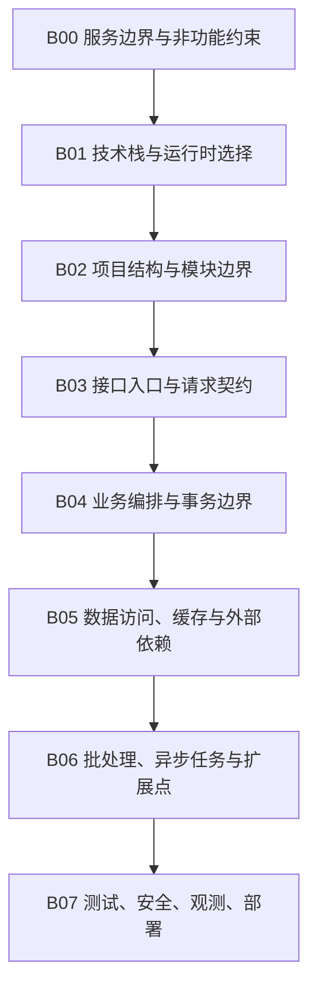

# 后端架构

## 知识点入口

- 本模块先看宏观流程，再看文章：[知识地图](070100_核心知识点/知识地图.md)。
- 新文章必须先归入具体后端路线，再判断是补充、冲突、不同层次还是降权。
- `文章/` 根目录不再作为长期入口；文章锚点放到具体路线目录的 `文章/` 下。

## 目录目的

本目录按后端服务的可持续技术对象组织，不再把语言、框架和案例混成一个文章池。

每个路线目录的 `AGENTS.md` 都应该回答：

1. 该路线的后端应用流程节点是什么。
2. 每篇文章优化哪个流程节点。
3. 当前沉淀是补充、冲突、不同层次还是降权。
4. 哪些文章只是资讯、案例或工具推荐，不能直接写成工程准则。
5. 文章文件只放在对应路线目录的 `文章/` 下，长期知识进入 `070100_核心知识点/`。

## 类目定位

| 项 | 内容 |
|---|---|
| 一级类目 | 工程与架构 |
| 二级类目 | 后端架构 |
| 核心问题 | 后端服务如何组织语言机制、应用框架、接口、数据访问、任务、集成、扩展和生产运行 |
| 不解决什么 | 前端框架、跨系统测试质量、通用安全治理、数据分析方法、电脑工具安装 |
| 用户当前认知假设 | 以 [用户画像.md](../../用户画像.md) 为准；少讲入门，多补边界、对标、失败模式和可迁移准则 |

## 技术路线

| 路线 | 流程入口 | 当前文章数 | 当前状态 |
|---|---|---:|---|
| Python | [Python/AGENTS.md](070103_Python/AGENTS.md) | 31 | 当前主线是 FastAPI/Pydantic：应用入口、路由、请求响应模型、认证、性能、中间件、镜像和部署 |
| Java | [Java/AGENTS.md](070101_Java/AGENTS.md) | 10 | 当前主线回到 Java 语言机制和通用后端模式：反射、函数式接口、缓存组合、SPI、Panama、动态模块、Pipeline |
| SpringBoot | [SpringBoot/AGENTS.md](070105_SpringBoot/AGENTS.md) | 18 | 新拆出的 Spring Boot 应用路线：分层、接口契约、幂等、外部依赖、数据/文件集成、批处理、插件和性能 |
| Node | [Node/AGENTS.md](070102_Node/AGENTS.md) | 5 | 当前证据仍不足：已有文章主要校准 Next/Nuxt 渲染边界、TypeScript 运行时校验缺口、序列化和前端状态持久化风险 |
| Rust | [Rust/AGENTS.md](070104_Rust/AGENTS.md) | 4 | 新拆出的 Rust 工程路线：所有权、Cargo 工程结构、流式 I/O、零拷贝、背压和安全关键场景 |

## 统一后端流程



## 路线边界

| 文章主问题 | 应进入 | 不应进入 |
|---|---|---|
| FastAPI、Pydantic、SQLAlchemy、SQLModel、Python 服务结构、中间件、认证、镜像 | `Python` | 统计方法、AI 测试平台、纯数据清洗方法 |
| Java 语言机制、反射、函数式接口、SPI、Panama、缓存组合、动态模块、通用 Pipeline 模式 | `Java` | Spring Boot 应用框架专项；这些进入 `SpringBoot` |
| Spring Boot 自动配置、Controller、校验、幂等、外部接口、Resilience4j、HikariCP、EasyExcel、MinIO、Tika、Calcite、Spring Batch、LiteFlow、动态 jar | `SpringBoot` | 跨系统接口契约治理、压测平台、安全权限和可观测性总线；这些进入 `0703` |
| Node 服务端运行时、BFF、SSR/API 边界、序列化、运行时校验 | `Node` | 单纯前端 Nuxt/Vue/React 工程 |
| Rust 所有权、Cargo、crate/workspace、Tokio/async、流式 I/O、零拷贝、Axum/Actix、系统安全边界 | `Rust` | 只是“用 Rust 写成”的工具、数据库、数据平台或文档工具；这些按技术本体留在对应目录 |

## 本轮目录纠偏

| 原位置 | 处理 |
|---|---|
| `07_工程与架构/文章` | 已清空并删除；其中 FastAPI/Pydantic 进 `Python`，Java 语言机制进 `Java`，Spring Boot 进 `SpringBoot`，跨域文章迁出到对应大类 |
| `0701_后端架构/文章` 中的 Rust 文章 | 已迁入 [Rust/文章](070104_Rust/文章)；Rust 目录只承载 Rust 语言和工程机制，不承载所有 Rust 实现的工具 |
| `Java/文章` 中的 Spring Boot 文章 | 已迁入 [SpringBoot/文章](070105_SpringBoot/文章)；Java 目录不再承载 Spring Boot 主线 |
| 统计学、智能问数、Kestra、SQL 查询优化、前端框架、测试平台、接口规范 | 已按技术本体迁出到统计方法、语义层与智能问数、调度编排、查询优化、前端工程、测试质量、接口契约与网关 |

## 跨路线对比入口

| 流程问题 | Python | Java | SpringBoot | Node | Rust |
|---|---|---|---|---|---|
| 项目边界 | FastAPI 应用结构、配置、依赖 | Maven/模块/语言机制边界 | Spring Boot 自动配置、Starter、分层和启动装配 | Node 运行时、BFF、SSR/API 边界 | Cargo、crate、workspace、feature |
| 入口适配 | Router、Depends、中间件 | 反射/SPI/Pipeline 等通用机制 | Controller、DTO、Bean Validation、外部接口 | Router、Controller、Middleware，当前证据不足 | Axum/Actix/Tower，当前缺来源 |
| 请求校验 | Pydantic / SQLModel | Java 类型与 Bean Validation 的底层约束 | `@Valid`、`@Validated`、统一异常 | TypeScript 不够，需要运行时校验 | 类型系统、serde、validator，当前缺来源 |
| 业务编排 | Service 层 | 函数式接口、Pipeline、领域对象 | Application Service、六边形、规则引擎 | Service / UseCase，当前缺来源 | trait、Result、错误层级，当前缺来源 |
| 数据访问 | SQLAlchemy 2.0 / SQLModel | 缓存组合、SQL 写法线索 | HikariCP、Calcite、文件/对象存储集成 | Prisma / TypeORM / Drizzle，当前缺来源 | SQLx/SeaORM/Redis，当前缺来源 |
| 可靠性 | 中间件、认证、镜像、异步配置 | SPI/模块机制、缓存、动态模块 | 幂等、超时、fallback、批处理、动态插件 | 当前缺限流、任务队列、观测和部署来源 | 所有权、背压、零拷贝、安全关键边界，缺观测和发布来源 |

## 新文章进入时的处理流程

```text
文章主问题
  -> 技术路线: Python / Java / SpringBoot / Node / Rust
  -> 流程节点: 对应路线 AGENTS.md 中的节点
  -> 读取节点已有沉淀
  -> 读取对应核心知识点
  -> 判断补充 / 冲突 / 不同层次 / 更好的方式 / 低价值
  -> 更新核心知识点和 AGENTS 节点
```

## 当前补证优先级

| 优先级 | 方向 | 原因 |
|---|---|---|
| P0 | SpringBoot 安全、测试、观测、配置和部署 | Spring Boot 文章最多，已独立成路线，但生产关键节点还缺稳定沉淀 |
| P0 | Python FastAPI 认证、中间件、性能和部署 | 文章池扩大到 31 篇，需要从教程池抽可复用准则 |
| P1 | Java 语言机制和 SpringBoot 的边界 | Java 目录仍有部分核心知识点历史上混入 Spring Boot，需要后续逐步迁移 |
| P1 | Node 真实服务端框架 | 当前 Node 证据不足，不能指导真实 API 后端 |
| P1 | Rust async、Web/API 服务、数据访问和生产发布 | 当前 Rust 只有语言、Cargo 和流式 I/O 线索，还不能支撑完整后端服务路线 |
