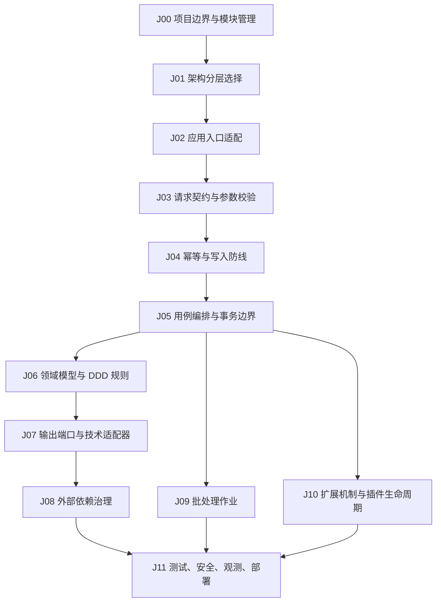

# Java
## 知识点入口

- 本模块先看宏观流程，再看文章：[流程化知识点总览](knowledge/07_工程与架构/0701_后端架构/Java/核心知识点/流程化知识点总览.md)。
- 新文章必须先归入流程节点，再判断是补充、冲突、不同层次还是降权。
- `文章/` 只保留原文锚点，长期知识必须沉淀到 `核心知识点/`。

## 这个目录记录什么

这个文件是 Java 应用的流程入口。

目标不是保存文章列表，也不是把文章摘要堆在一起，而是像人建立记忆一样：

1. 先有一条 Java 应用从开发到运行的主流程。
2. 每个核心知识点都挂到一个流程节点上。
3. 新文章来了，先判断它优化的是哪个流程节点。
4. 再把文章内容和该节点已有沉淀对比：是补充、冲突、不同层次，还是更好的写法。
5. 对比后只更新对应流程节点和核心知识点，不单独保留独立来源汇总文件。

## Java 应用流程

## 流程节点与核心知识点

| 节点 | 这个节点要解决什么 | 对应核心知识点 | 当前沉淀 |
|---|---|---|---|
| J00 项目边界与模块管理 | 这是单模块、多模块，还是平台型系统；Maven 父子模块、依赖版本、插件怎么管 | [Maven项目管理与模块边界.md](核心知识点/Maven项目管理与模块边界.md)、[Java核心知识点准则.md](核心知识点/Java核心知识点准则.md) | 当前缺文章支撑，只建立了模块边界准则 |
| J01 架构分层选择 | 轻量分层、经典六边形、DDD + 六边形怎么选 | [标准项目架构与代码组织.md](核心知识点/标准项目架构与代码组织.md)、[DDD开发规范与落地边界.md](核心知识点/DDD开发规范与落地边界.md) | 六边形文章补充了三档架构强度 |
| J02 应用入口适配 | REST、定时任务、消息、批处理分别怎么进入系统 | [Java作为后端服务的完整流程.md](核心知识点/Java作为后端服务的完整流程.md)、[标准项目架构与代码组织.md](核心知识点/标准项目架构与代码组织.md) | Controller 只是入口适配器，不能写业务规则 |
| J03 请求契约与参数校验 | DTO、`@Valid`、`@Validated`、嵌套校验、统一异常怎么写 | [标准项目架构与代码组织.md](核心知识点/标准项目架构与代码组织.md)、[Java作为后端服务的完整流程.md](核心知识点/Java作为后端服务的完整流程.md) | 参数校验文章补齐了入口契约写法 |
| J04 幂等与写入防线 | 重复提交、超时重试、并发更新怎么防 | [Java作为后端服务的完整流程.md](核心知识点/Java作为后端服务的完整流程.md) | 幂等文章补齐了唯一键、乐观锁、Token、下游序列号的选择 |
| J05 用例编排与事务边界 | Application Service 负责什么，事务放哪里 | [Java作为后端服务的完整流程.md](核心知识点/Java作为后端服务的完整流程.md)、[标准项目架构与代码组织.md](核心知识点/标准项目架构与代码组织.md) | 六边形文章强化了输入端口、应用服务、输出端口的关系 |
| J06 领域模型与 DDD 规则 | 实体、值对象、聚合、领域服务、仓储接口、领域事件怎么写 | [DDD开发规范与落地边界.md](核心知识点/DDD开发规范与落地边界.md) | 当前只有 DDD + 六边形的边界，还缺聚合边界和领域事件资料 |
| J07 输出端口与技术适配器 | Repository、ExternalClient、MessagePort 如何隔离 JPA、MyBatis、HTTP、MQ、Redis | [标准项目架构与代码组织.md](核心知识点/标准项目架构与代码组织.md)、[Java作为后端服务的完整流程.md](核心知识点/Java作为后端服务的完整流程.md) | 六边形文章补齐端口和适配器思想 |
| J08 外部依赖治理 | 第三方接口、远程服务、慢查询、文件处理怎么设置时间边界和降级 | [Java作为后端服务的完整流程.md](核心知识点/Java作为后端服务的完整流程.md) | Resilience4j 文章只补 TimeLimiter 和 fallback，不能当完整韧性治理 |
| J09 批处理作业 | 导入、对账、迁移、日终任务怎么可追踪、可重启、可分块提交 | [Java作为后端服务的完整流程.md](核心知识点/Java作为后端服务的完整流程.md) | Spring Batch 文章补齐 Job、Step、JobRepository、chunk、skip |
| J10 扩展机制与插件生命周期 | SPI、动态 jar、动态 Bean、动态任务怎么加载、注册、卸载和审计 | [Java作为后端服务的完整流程.md](核心知识点/Java作为后端服务的完整流程.md)、[DDD开发规范与落地边界.md](核心知识点/DDD开发规范与落地边界.md) | SPI 文章补扩展点发现；动态 jar 文章补生命周期风险 |
| J11 测试、安全、观测、部署 | 测试分层、认证授权、日志指标链路、健康检查、发布回滚 | 暂无稳定核心知识点 | 当前缺文章和实践支撑，是后续补齐重点 |

## 流程节点上的现有对比结论

| 流程节点            | 原有沉淀                        | 文章带来的对比                                                                               | 处理结果             | 来源锚点                                                                                                                                                          |
| --------------- | --------------------------- | ------------------------------------------------------------------------------------- | ---------------- | ------------------------------------------------------------------------------------------------------------------------------------------------------------- |
| J01 架构分层选择      | 需要分层，但没有明确不同复杂度怎么选          | 六边形文章补齐“轻量分层 / 经典六边形 / DDD + 六边形”三档选择；不是冲突，是更细的选择准则                                   | 升级标准项目架构和 DDD 边界 | [SpringBoot 的 3 种六边形架构应用方式](文章/SpringBoot的3种六边形架构应用方式.md)                                                                            |
| J03 请求契约与参数校验   | Controller 接收 DTO，DTO 做参数校验 | 参数校验文章补齐 `@Validated` 方法参数和分组校验、`@Valid` 嵌套对象校验、统一异常；同时校准“参数校验不是业务规则”                 | 写入请求契约节点         | [和 if else 说再见，SpringBoot 这样做参数校验才足够优雅](文章/和 if else说再见，SpringBoot 这样做参数校验才足够优雅！.md)                                                 |
| J04 幂等与写入防线     | 写接口要考虑幂等，但方案选择不清晰           | 幂等文章把副作用拆成插入、更新、前端重复提交、上下游调用；和无脑 Redis Token 的做法冲突                                    | 升级为“按副作用选幂等方案”   | [SpringBoot 实现接口幂等性的 4 种方案](文章/SpringBoot 实现接口幂等性的 4 种方案！.md)                                                                           |
| J05 用例编排与事务边界   | Application Service 负责用例和事务 | 六边形文章强化输入端口、应用服务、输出端口的关系；和原沉淀不冲突，提供更清晰职责分配                                            | 写入服务完整流程         | [SpringBoot 的 3 种六边形架构应用方式](文章/SpringBoot的3种六边形架构应用方式.md)                                                                            |
| J07 输出端口与技术适配器  | 需要隔离数据库、第三方 API、消息等外部技术     | 六边形文章补齐端口和适配器写法；说明外部技术不能反向污染业务核心                                                      | 写入标准项目架构和服务完整流程  | [SpringBoot 的 3 种六边形架构应用方式](文章/SpringBoot的3种六边形架构应用方式.md)                                                                            |
| J08 外部依赖治理      | 外部调用要有超时和降级                 | Resilience4j 文章只补 TimeLimiter + fallback 的时间边界；和完整韧性治理不是同一层次，不能替代熔断、重试、隔离、限流          | 降权吸收为时间边界        | [SpringBoot 整合 Resilience4j](文章/SpringBoot整合Resilience4j，解决长时间等待第三方API迟迟不响应的问题.md)                                                   |
| J09 批处理作业       | 定时任务和批量循环容易混在一起             | Spring Batch 文章纠偏：批处理核心是 Job/Step 执行元数据、chunk 事务和 skip 策略，不是普通 Web 请求流程               | 写入批处理节点          | [Spring Batch 批处理框架](文章/Spring Batch 批处理框架，真的太强悍了！！.md)                                                                            |
| J10 扩展机制与插件生命周期 | 插件化需要扩展点，但生命周期风险不清晰         | SPI 文章补扩展点发现；动态 jar 文章补 ClassLoader、Spring Bean、任务注册、配置状态四套生命周期一致性；“插件化就是加载 jar”是错误记忆 | 写入扩展机制节点，并标高风险   | [Java SPI 机制初探](文章/Java SPI机制初探｜得物技术.md)、[SpringBoot 动态加载 jar 包，动态配置方案](文章/SpringBoot 动态加载 jar 包，动态配置方案.md) |

## 新文章进入时的处理流程

新文章不能再新增独立来源汇总文件。处理顺序固定如下：

| 顺序 | 动作 | 要回答的问题 | 结果 |
|---|---|---|---|
| 1 | 判断文章主问题 | 它优化的是 J00-J11 哪个流程节点？ | 得到目标节点 |
| 2 | 读取目标节点 | AGENTS 中该节点已有沉淀是什么？ | 得到已有判断 |
| 3 | 读取对应核心知识点 | 该节点的正文已经写了什么？ | 得到可对比对象 |
| 4 | 对比文章内容 | 是补充、冲突、不同层次，还是更好的方式？ | 得到处理类型 |
| 5 | 更新知识点正文 | 如果有价值，直接改对应核心知识点；如果节点不够表达，先优化 AGENTS 流程节点 | 完成沉淀 |
| 6 | 保留来源锚点 | 只在对应节点或核心知识点中保留文章链接和关键判断 | 不生成独立来源汇总文件 |

## 对比类型

| 类型 | 判断 | 怎么处理 |
|---|---|---|
| 补充 | 文章补上已有节点缺少的机制、边界、代码写法 | 写入对应核心知识点 |
| 冲突 | 文章说法和已有沉淀不一致，或标题夸大 | 在节点中标明冲突和降权原因 |
| 不同层次 | 文章讲的是专项能力，不是主流程默认做法 | 放到专项节点，不覆盖主流程 |
| 更好的方式 | 文章给出比已有沉淀更清晰的分层、判断或代码写法 | 替换或升级原有准则，并保留为什么更好 |
| 无对应节点 | 文章确实优化了 Java 流程，但 J00-J11 无法承载 | 先新增或调整流程节点，再写入知识点 |
| 低价值 | 只有标题党、常识、广告、无证据最佳实践 | 不进入核心知识点 |

## 新文章路由速查

| 文章主问题 | 优先路由节点 | 先读核心知识点 |
|---|---|---|
| 项目结构、包结构、分层、六边形 | J01、J02、J05、J07 | 标准项目架构与代码组织、Java 作为后端服务的完整流程 |
| Maven、BOM、父子模块、依赖冲突、插件 | J00 | Maven 项目管理与模块边界 |
| DDD、聚合、实体、值对象、领域事件 | J06 | DDD 开发规范与落地边界 |
| Controller、DTO、参数校验、异常返回 | J03 | 标准项目架构与代码组织、Java 作为后端服务的完整流程 |
| 幂等、事务、并发更新、重复提交 | J04、J05 | Java 作为后端服务的完整流程 |
| Repository、JPA、MyBatis、第三方客户端、MQ | J07、J08 | 标准项目架构与代码组织、Java 作为后端服务的完整流程 |
| 超时、熔断、重试、隔离、限流 | J08 | Java 作为后端服务的完整流程 |
| 导入、对账、迁移、日终、批量处理 | J09 | Java 作为后端服务的完整流程 |
| SPI、插件、动态 jar、动态任务、规则引擎 | J10 | Java 作为后端服务的完整流程 |
| 测试、安全、权限、日志、指标、链路、部署 | J11 | 当前缺核心知识点，应先补节点和新知识点 |

## 当前明显缺口

| 流程节点 | 缺什么 | 为什么重要 |
|---|---|---|
| J00 项目边界与模块管理 | Maven 官方机制、多模块真实项目样例、依赖收敛 | 决定项目能否长期维护 |
| J06 领域模型与 DDD 规则 | 聚合边界、领域事件、防腐层、复杂查询 | 当前只知道 DDD 适用边界，不够指导代码 |
| J08 外部依赖治理 | CircuitBreaker、Retry、Bulkhead、RateLimiter | 当前只有 TimeLimiter，稳定性治理不完整 |
| J11 测试、安全、观测、部署 | Spring Security、测试分层、日志指标链路、健康检查、发布回滚 | 后端服务上线后必须依赖这些能力 |
