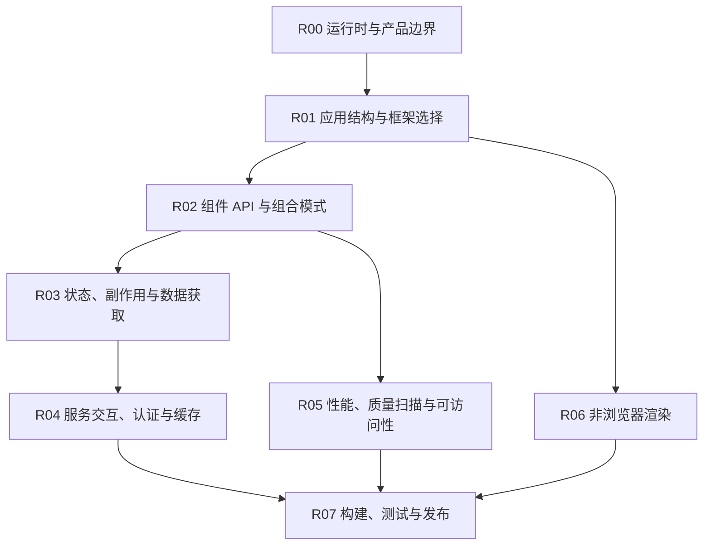

# React

## 知识点入口

- 本模块先看宏观流程，再看文章：[知识地图](070202_知识地图.md)。
- 新文章必须先归入流程节点，再判断是补充、冲突、不同层次还是降权。
- `文章/` 只保留原文锚点，知识地图维护在 `070202_知识地图.md`；长期知识点写入 `070202_核心知识点/` 目录。

## 这个目录记录什么

这个文件是 React 应用的流程入口。

当前来源覆盖组件组合、React Query、Next/TanStack Start、React 专项质量扫描、终端 UI 和视频渲染。它们不能混成“React 很强”的泛结论，必须按 React 在不同运行时里的职责拆开。

## React 应用流程

## 流程节点与核心知识点

| 节点 | 这个节点要解决什么 | 当前来源 | 当前沉淀 |
|---|---|---|---|
| R00 运行时与产品边界 | Web 应用、全栈应用、终端 UI、视频渲染是否是同一个问题 | Ink、Remotion、Zig+React TUI | React 是渲染模型，不等于只服务浏览器页面 |
| R01 应用结构与框架选择 | Next.js、TanStack Start、普通 React 应用怎么选 | TanStack Start、Next.js 迁移文章 | “告别 Next.js”先降权，重点看路由、数据、认证和部署边界 |
| R02 组件 API 与组合模式 | 怎么避免布尔属性泛滥、组合失控、状态耦合 | Vercel 组件组合模式、React 架构译文 | 组件 API 应围绕状态边界和复用层级设计 |
| R03 状态、副作用与数据获取 | React Query、Hook、副作用、服务状态如何组织 | React Query 模式文章 | 数据获取要区分服务状态、客户端状态和缓存失效 |
| R04 服务交互、认证与缓存 | 前端全栈栈如何处理认证、服务函数和 API 边界 | TanStack Start + Better Auth、Next.js 迁移 | 还缺稳定证据，后续精读再沉淀 |
| R05 性能、质量扫描与可访问性 | React 代码质量如何进入 CI 和 AI 生成代码守门 | React Doctor、Million.js 代码体检 | 质量文章必须落到规则、AST、CI、修复路径 |
| R06 非浏览器渲染 | React 渲染模型如何用于 CLI、视频、终端框架 | Ink、Remotion、Zig+React TUI | 作为特殊渲染路线，不覆盖 Web 主线 |
| R07 构建、测试与发布 | React 项目如何做回归、质量门禁和发布 | 当前缺少稳定来源 | 后续补测试、包体、性能预算和回滚 |

## 流程节点上的现有对比结论

| 流程节点 | 文章带来的对比 | 处理结果 | 来源锚点 |
|---|---|---|---|
| R02 组件 API 与组合模式 | 布尔属性会让组件状态空间爆炸，复合组件和显式状态模型更可控 | 候选正式沉淀 | [Vercel 官方组件组合模式](文章/done-Vercel官方组件组合模式：让React代码告别_布尔地狱_.md) |
| R03 状态、副作用与数据获取 | React Query 不是普通请求封装，而是服务状态缓存和失效策略 | 候选正式沉淀 | [React Query 模式](<文章/done-译文：每个开发者都应该了解的基本 React Query模式.md>) |
| R05 性能、质量扫描与可访问性 | AI 生成 React 代码需要确定性规则和 CI 守门，不只靠提示词 | 与 React Doctor 排重后再沉淀 | [Million.js 代码体检](<文章/done-AI 写的 React 全是坑？Million.js 作者祭出「代码体检」神器，GitHub 狂揽近万 Star！.md>)、[React Doctor](<文章/done-告别“代码破窗效应”——React Doctor：给你的 React 项目来一次全面体检.md>) |
| R06 非浏览器渲染 | Ink、Remotion、终端 UI 说明 React 组件模型可迁移，但不等于 Web 架构准则 | 降权为特殊运行时 | [用 React 构建命令行应用](<文章/done-用 React 优雅地构建命令行应用.md>)、[React 写视频](<文章/done-万星_开源_用 React 代码_写_视频，超级生产力.md>)、[Zig + React 终端 UI](<文章/done-Zig 写引擎、React 写界面，这个终端 UI 框架让命令行彻底变了.md>) |

## 新文章路由速查

| 文章主问题 | 优先路由节点 |
|---|---|
| React 项目结构、Next/TanStack Start、全栈栈 | R00、R01、R04 |
| 组件 API、复合组件、设计系统组件 | R02 |
| Hook、React Query、状态管理、缓存 | R03 |
| 性能、代码扫描、AI 生成代码质量 | R05 |
| Ink、Remotion、终端 UI、视频渲染 | R06 |
| 测试、包体、构建、发布 | R07 |

## 当前明显缺口

| 缺口 | 为什么重要 |
|---|---|
| React 项目真实目录分层 | 现有文章还不足以指导大型项目如何拆模块 |
| 测试与可视化回归 | 质量扫描文章多，但测试闭环不足 |
| Next.js 与 TanStack Start 官方边界 | 选型文章标题强，需要后续补证 |
| 可访问性与设计系统治理 | 当前组件文章还缺体验质量和长期治理 |

## 2026-06-18 来源校准

- 从 `99_人工筛查/07_工程与架构` 拉回来源：13 篇。
- 本轮核心入口：[React架构与质量边界准则](070202_核心知识点/React架构与质量边界准则.md)。
- 本轮知识地图入口：[070202_React知识地图](070202_知识地图.md)。
- 处理口径：保留文章必须同时有 `已吸收至` 反向链接，并被核心知识点或知识地图引用；标题党、版本资讯、工具清单只作为降权或补证来源。
