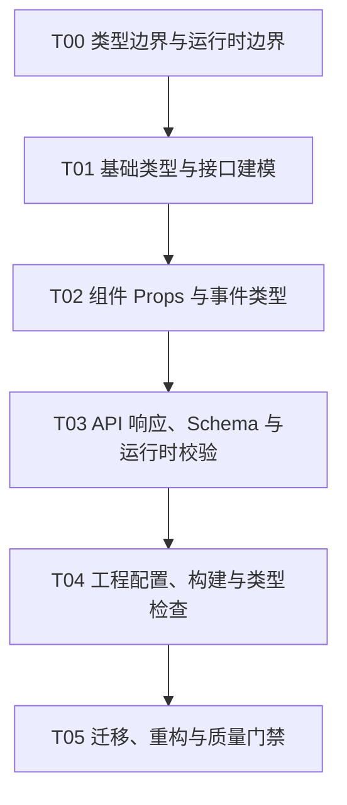

# TypeScript

## 知识点入口

- 本模块先看宏观流程，再看文章：[知识地图](070203_知识地图.md)。
- 新文章必须先归入流程节点，再判断是补充、冲突、不同层次还是降权。
- `文章/` 只保留原文锚点，知识地图维护在 `070203_知识地图.md`；长期知识点写入 `070203_核心知识点/` 目录。

## 这个目录记录什么

这个文件是前端 TypeScript 的流程入口。

当前只有一篇基础梳理文章，因此本目录先作为类型边界入口，而不是完整 TypeScript 知识体系。后续重点不是重复语法，而是补“编译期类型、运行时输入、框架数据边界、API 契约”的关系。

## TypeScript 前端流程

## 流程节点与当前沉淀

| 节点 | 这个节点要解决什么 | 当前来源 | 当前沉淀 |
|---|---|---|---|
| T00 类型边界与运行时边界 | TypeScript 能保证什么，不能保证什么 | 当前缺稳定来源 | 必须强调 TS 不能替代运行时输入校验 |
| T01 基础类型与接口建模 | type、interface、函数、泛型如何表达领域数据 | TypeScript 核心知识点梳理 | 基础文章只作为入门锚点 |
| T02 组件 Props 与事件类型 | 前端组件 API 如何类型化 | 当前缺来源 | 后续应与 React/Vue 组件文章联动 |
| T03 API 响应、Schema 与运行时校验 | 外部数据如何校验、推断和错误处理 | 当前缺来源 | 需要补 Zod、Valibot、TypeBox 等证据 |
| T04 工程配置、构建与类型检查 | tsconfig、构建、类型检查如何进入 CI | 当前缺来源 | 后续补工程化资料 |
| T05 迁移、重构与质量门禁 | JS 到 TS、any 治理、类型覆盖率如何推进 | 当前缺来源 | 后续补迁移实践 |

## 新文章路由速查

| 文章主问题 | 优先路由节点 |
|---|---|
| 基础类型、函数、接口、泛型 | T01 |
| React/Vue 组件 Props、事件、插槽类型 | T02 |
| API 响应、表单输入、运行时校验 | T03 |
| tsconfig、构建、monorepo 类型检查 | T04 |
| 迁移、重构、any 治理 | T05 |

## 当前明显缺口

| 缺口 | 为什么重要 |
|---|---|
| 运行时校验 | 外部请求、模型输出和后端响应不能靠 TS 编译期保证 |
| 框架组件类型模式 | 用户更需要 React/Vue 中如何落地，而不是孤立语法 |
| CI 类型门禁 | 类型系统价值要进入质量闭环 |

## 2026-06-18 来源校准

- 从 `99_人工筛查/07_工程与架构` 拉回来源：3 篇。
- 本轮核心入口：[TypeScript类型边界准则](070203_核心知识点/TypeScript类型边界准则.md)。
- 本轮知识地图入口：[070203_TypeScript知识地图](070203_知识地图.md)。
- 处理口径：保留文章必须同时有 `已吸收至` 反向链接，并被核心知识点或知识地图引用；标题党、版本资讯、工具清单只作为降权或补证来源。
