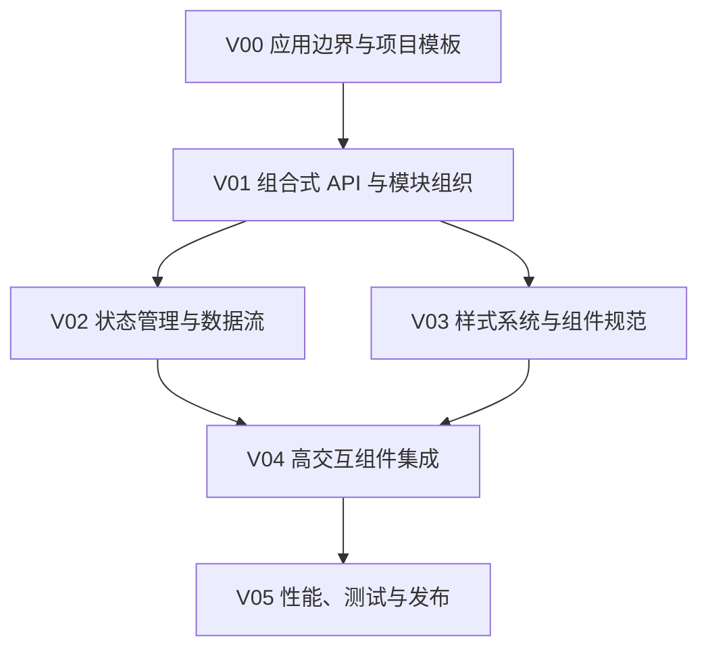

# Vue

## 知识点入口

- 本模块先看宏观流程，再看文章：[知识地图](070204_核心知识点/知识地图.md)。
- 新文章必须先归入流程节点，再判断是补充、冲突、不同层次还是降权。
- `文章/` 只保留原文锚点，长期知识必须沉淀到 `070204_核心知识点/`。

## 这个目录记录什么

这个文件是 Vue 应用的流程入口。

当前来源覆盖 Vue3 模板工程、Pinia、SCSS/UnoCSS、复杂表格、Power BI 组件、基于 Vue3 的三维/数字孪生框架、Vue3 + FastAPI 全栈工具台案例，以及 wujie/Omi 这类前端框架资讯。它们的共同点不是“Vue 生态资讯”，而是 Vue 项目如何组织状态、样式、复杂组件、高交互集成和前后端边界。

## Vue 应用流程

## 流程节点与当前沉淀

| 节点 | 这个节点要解决什么 | 当前来源 | 当前沉淀 |
|---|---|---|---|
| V00 应用边界与项目模板 | Vue 应用是管理后台、组件集成、数据展示、开发者工具台还是三维交互 | Vue3 通用模板、数字孪生、Power BI 组件、Vue3 + FastAPI 工具台 | 先判断应用形态，再谈封装方式 |
| V01 组合式 API 与模块组织 | composable、store、组件、工具函数如何分层 | 当前缺稳定来源 | 后续需要补 Vue 项目级结构 |
| V02 状态管理与数据流 | Pinia 如何封装，状态与服务数据如何分开 | Pinia 封装文章 | Pinia 文章候选精读，但需补测试和持久化边界 |
| V03 样式系统与组件规范 | SCSS、UnoCSS、组件样式、设计令牌如何组织 | SCSS/UnoCSS 文章 | 样式工程不能只看写法，要看长期维护和冲突边界 |
| V04 高交互组件集成 | 表格、BI 组件、三维框架、微前端/跨框架组件如何接入 Vue 应用 | handsontable、Power BI、三维框架、wujie/Omi | 重点看数据量、事件、状态同步、隔离和性能 |
| V05 性能、测试与发布 | Vue 项目如何验证复杂交互和发布 | 当前缺稳定来源 | 后续补 E2E、性能和构建发布 |

## 新文章路由速查

| 文章主问题 | 优先路由节点 |
|---|---|
| Vue 项目模板、目录结构、脚手架 | V00、V01 |
| composable、Pinia、状态封装 | V01、V02 |
| SCSS、UnoCSS、主题、样式规范 | V03 |
| 表格、图表、BI、三维、编辑器组件 | V04 |
| 测试、性能、构建、发布 | V05 |

## 当前明显缺口

| 缺口 | 为什么重要 |
|---|---|
| Vue 项目级分层与组合式函数规范 | 当前文章偏单点集成，无法指导完整应用结构 |
| Pinia 与服务状态边界 | 需要避免把所有远程数据都塞进全局 store |
| 高交互组件的性能指标 | 表格和三维文章缺真实数据量、帧率或交互延迟证据 |
| 测试和发布 | Vue 路线还缺质量闭环 |
