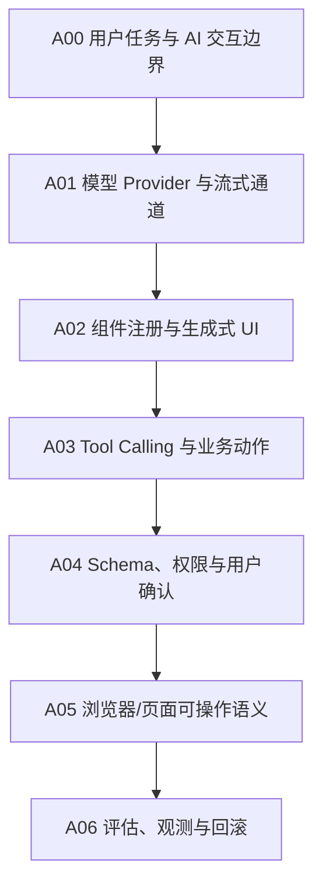

# 前端 AI 应用

## 知识点入口

- 本模块先看宏观流程，再看文章：[知识地图](070205_知识地图.md)。
- 新文章必须先归入流程节点，再判断是补充、冲突、不同层次还是降权。
- `文章/` 只保留原文锚点，知识地图维护在 `070205_知识地图.md`；长期知识点写入 `070205_核心知识点/` 目录。

## 这个目录记录什么

这个文件记录前端如何接入模型、生成式 UI、流式响应、工具调用和 AI 可操作页面。

边界要明确：如果文章主问题是 Claude Code、Cursor、Skill、AI 编程工作流，应该归 `02_Agent与AI工程/0205_AI编程工具`；只有主问题是前端应用运行时和用户界面接入 AI，才留在这里。

## 前端 AI 应用流程

## 流程节点与当前沉淀

| 节点 | 这个节点要解决什么 | 当前来源 | 当前沉淀 |
|---|---|---|---|
| A00 用户任务与 AI 交互边界 | 用户到底要聊天、生成 UI、执行动作还是操作页面 | Tambo、TanStack AI、AI 版 Chrome | 先区分 UI 生成和工具执行 |
| A01 模型 Provider 与流式通道 | 模型、流式响应、多模型适配如何接入前端 | TanStack AI | 候选精读，但需补版本和官方边界 |
| A02 组件注册与生成式 UI | AI 如何选择、渲染和驱动已有组件 | Tambo、AI Elements Vue | 组件注册必须有 Schema 和可控范围 |
| A03 Tool Calling 与业务动作 | 前端 AI 如何调用本地工具或业务逻辑 | Tambo、TanStack AI | 需要关注副作用和权限 |
| A04 Schema、权限与用户确认 | 模型输出、工具参数、用户确认如何校验 | 当前缺稳定来源 | 这是后续最高优先级 |
| A05 浏览器/页面可操作语义 | 页面如何给 AI 暴露可执行操作 | AI 版 Chrome | 需官方补证，不能只按资讯采信 |
| A06 评估、观测与回滚 | 前端 AI 功能如何观测、失败降级和回滚 | 当前缺来源 | 后续补生产案例 |

## 新文章路由速查

| 文章主问题 | 优先路由节点 |
|---|---|
| 前端聊天、模型 Provider、流式响应 | A01 |
| AI 自动渲染组件、生成式 UI、AI 组件库 | A02 |
| Tool Calling、MCP、本地业务动作 | A03、A04 |
| 参数 Schema、权限、用户确认、安全边界 | A04 |
| 浏览器给 AI 暴露操作语义、AI 可操作网页 | A05 |
| 评估、埋点、回滚、失败处理 | A06 |

## 当前明显缺口

| 缺口 | 为什么重要 |
|---|---|
| 权限与用户确认机制 | 前端 AI 应用最容易把模型建议变成未经确认的业务副作用 |
| Schema 和类型安全 | 生成式 UI 与工具调用都依赖可校验参数 |
| 失败降级和回滚 | 模型不可控时要有普通 UI 和人工确认路径 |
| 官方补证 | 当前多为资讯/教程，不能直接形成稳定技术结论 |

## 2026-06-18 来源校准

- 从 `99_人工筛查/07_工程与架构` 拉回来源：15 篇。
- 本轮核心入口：[前端AI生成式UI与工具调用边界](070205_核心知识点/前端AI生成式UI与工具调用边界.md)。
- 本轮知识地图入口：[070205_前端AI应用知识地图](070205_知识地图.md)。
- 处理口径：保留文章必须同时有 `已吸收至` 反向链接，并被核心知识点或知识地图引用；标题党、版本资讯、工具清单只作为降权或补证来源。
