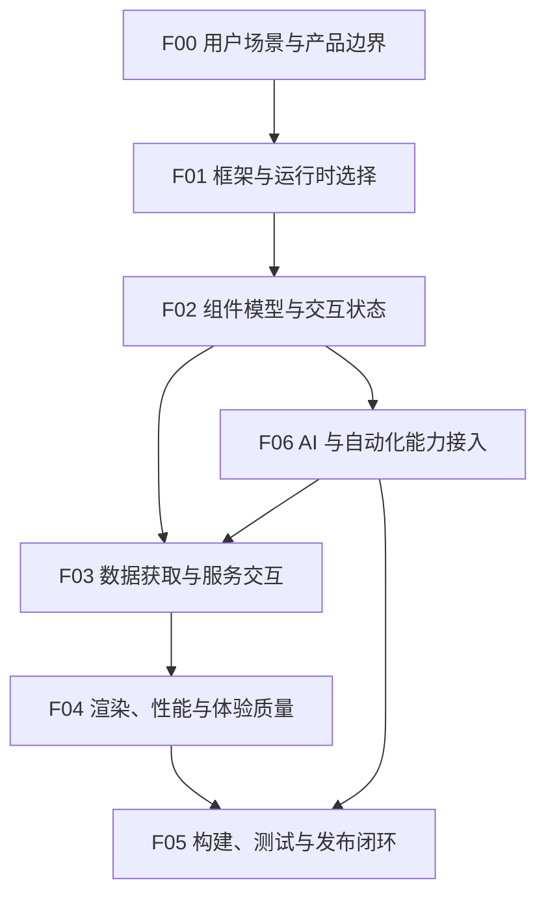

# 前端工程

## 知识点入口

- 本模块先看宏观流程，再看文章：[流程化知识点总览](核心知识点/流程化知识点总览.md)。
- 本轮拆分路由表：[文章拆分路由表](核心知识点/文章拆分路由表.md)。
- 新文章必须先归入具体技术路线，再判断是补充、冲突、不同层次还是降权。
- `文章/` 根目录不再作为长期入口；文章锚点放到具体路线目录的 `文章/` 下。

## 目录目的

本目录按前端工程的可持续技术对象建立入口，而不是把所有 Web、React、Vue、Nuxt、AI UI、工程化文章混在一个池子里。

每个路线目录的 `AGENTS.md` 都应该回答：

1. 该路线的前端应用流程节点是什么。
2. 每篇文章优化哪个流程节点。
3. 当前沉淀是补充、冲突、不同层次还是降权。
4. 文章是否只提供资讯或工具推荐，不能直接写成工程准则。
5. 文章文件只放在对应路线目录的 `文章/` 下，长期知识进入 `核心知识点/`。

## 类目定位

| 项 | 内容 |
|---|---|
| 一级类目 | 工程与架构 |
| 二级类目 | 前端工程 |
| 核心问题 | 前端应用如何组织框架、组件、状态、渲染、交互、构建、测试、发布和 AI 接入 |
| 不解决什么 | 后端认证框架、通用工程质量、AI 编程工具规则、纯设计素材和工具推荐 |
| 用户当前认知假设 | 以 [用户画像.md](../../用户画像.md) 为准；少讲框架入门，多补边界、对标、失败模式和可迁移准则 |

## 技术路线

| 路线 | 流程入口 | 当前文章数 | 当前状态 |
|---|---|---:|---|
| React | [React/AGENTS.md](React/AGENTS.md) | 12 | 覆盖组件组合、Next/TanStack Start、React Query、质量扫描、非浏览器渲染；需要补真实项目分层与测试 |
| Vue | [Vue/AGENTS.md](Vue/AGENTS.md) | 5 | 覆盖 Pinia、样式工程、高交互组件、数字孪生和 BI 组件；需要补组合式函数、路由、测试和部署 |
| Nuxt | [Nuxt/AGENTS.md](Nuxt/AGENTS.md) | 8 | 覆盖 Nuxt 4、Layers、Nitro、认证、服务端/客户端组件、MDC；需要补生产部署和缓存策略 |
| TypeScript | [TypeScript/AGENTS.md](TypeScript/AGENTS.md) | 1 | 当前只有基础梳理，先作为前端类型边界入口；不能替代运行时校验和框架架构 |
| 前端 AI 应用 | [前端AI应用/AGENTS.md](前端AI应用/AGENTS.md) | 6 | 覆盖 Tambo、TanStack AI、AI Elements Vue、AI 版 Chrome；重点是 UI、模型、工具调用和权限边界 |
| 前端工程化与质量 | [前端工程化与质量/AGENTS.md](前端工程化与质量/AGENTS.md) | 2 | 覆盖前端趋势和 CLI E2E 测试；需要补构建、质量门禁、性能、可访问性和发布闭环 |

## 统一前端流程



## 路线边界

| 文章主问题 | 应进入 | 不应进入 |
|---|---|---|
| React 组件、Hook、React Query、Next/TanStack Start、React 专项质量 | `React` | 不因为出现 AI 或 CLI 就移走；先看 React 是否是核心实现对象 |
| Vue3、Pinia、Vue 组件集成、Vue 高交互应用 | `Vue` | Nuxt 专属目录结构、Nitro、SSR 认证流程应进 `Nuxt` |
| Nuxt 目录、Layers、Nitro、SSR/CSR、水合、NuxtAuth、MDC | `Nuxt` | 普通 Vue 组件或样式工程不硬塞进 Nuxt |
| 类型系统、泛型、函数接口、类型边界 | `TypeScript` | 外部输入校验、Zod 等运行时边界应按框架或工程质量继续拆 |
| 生成式 UI、前端 AI SDK、模型 Provider、Tool Calling、AI 可操作页面 | `前端AI应用` | AI 编程工具规则、Skill、Cursor/Claude Code 工作流应进 `02_Agent与AI工程/0205_AI编程工具` |
| 构建、测试、质量门禁、前端趋势、发布和回归 | `前端工程化与质量` | 跨系统测试平台、安全权限、后端测试治理应进 `0703_工程实践与质量保障` |

## 本轮目录纠偏

| 原文章 | 处理 |
|---|---|
| `用FastAPI-Users插件：10分钟搞定用户认证系统.md` | 移到 [0701_后端架构/Python/文章](../0701_后端架构/Python/文章/)；主问题是 FastAPI 后端认证 |
| `Spring Boot集成 Playwright及Groovy 动态自动化测试脚本.md` | 移到 [0703_工程实践与质量保障/文章](../0703_工程实践与质量保障/文章/)；主问题是测试质量与自动化 |
| `Skills之前端设计技能...`、`Impeccable...`、`前端设计 SVG skills...` | 移到 [02_Agent与AI工程/0205_AI编程工具/文章](../../02_Agent与AI工程/0205_AI编程工具/文章/)；主问题是 AI 编程/设计技能规则 |

## 新文章进入时的处理流程

```text
文章主问题
  -> 技术路线: React / Vue / Nuxt / TypeScript / 前端AI应用 / 前端工程化与质量
  -> 流程节点: 对应路线 AGENTS.md 中的节点
  -> 读取节点已有沉淀
  -> 读取对应核心知识点
  -> 判断补充 / 冲突 / 不同层次 / 更好的方式 / 低价值
  -> 更新核心知识点和 AGENTS 节点
```

## 当前补证优先级

| 优先级 | 方向 | 原因 |
|---|---|---|
| P0 | React 与 Nuxt 的生产架构边界 | 当前文章较多，但资讯、教程和工具介绍混杂，需要抽出稳定工程准则 |
| P0 | 前端 AI 应用的权限和工具调用边界 | 容易把生成式 UI 的演示误当成可生产落地能力 |
| P1 | Vue 工程化主线 | 现有 Vue 文章偏组件集成，缺项目级流程 |
| P1 | TypeScript 运行时边界 | 只有类型基础文章，不能支撑外部输入安全 |
| P1 | 前端质量门禁 | 需要补测试、性能、可访问性、安全和发布回归 |
