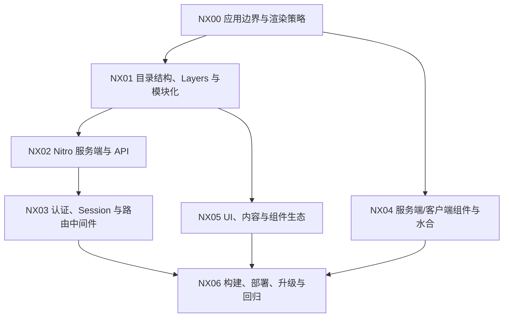

# Nuxt

## 知识点入口

- 本模块先看宏观流程，再看文章：[流程化知识点总览](核心知识点/流程化知识点总览.md)。
- 新文章必须先归入流程节点，再判断是补充、冲突、不同层次还是降权。
- `文章/` 只保留原文锚点，长期知识必须沉淀到 `核心知识点/`。

## 这个目录记录什么

这个文件是 Nuxt 应用的流程入口。

Nuxt 不只是 Vue 的一个目录结构扩展，它承担 SSR/CSR、Nitro 服务端、路由中间件、认证、水合、内容渲染和模块扩展边界。当前文章数量足够支撑独立路线，因此从 Vue 目录拆出。

## Nuxt 应用流程

## 流程节点与当前沉淀

| 节点 | 这个节点要解决什么 | 当前来源 | 当前沉淀 |
|---|---|---|---|
| NX00 应用边界与渲染策略 | Nuxt 应用是内容站、管理后台、全栈应用还是 API 边缘层 | Nuxt 4 发布、组件渲染进阶 | 发布资讯降权，渲染边界精读 |
| NX01 目录结构、Layers 与模块化 | Nuxt 4 新结构、Layers 如何复用和隔离 | Nuxt 4、Layers | Layers 候选正式沉淀，但需补版本证据 |
| NX02 Nitro 服务端与 API | Nitro API、Middleware、部署目标如何工作 | Nitro 文章 | 候选正式沉淀为 Nuxt 全栈边界 |
| NX03 认证、Session 与路由中间件 | JWT、Session/Cookie、OAuth、路由保护怎么选 | Nuxt 认证、NuxtAuth | 两篇先排重，再抽认证水合和安全边界 |
| NX04 服务端/客户端组件与水合 | 哪些组件在服务端渲染，哪些必须客户端执行 | 组件渲染进阶 | 候选正式沉淀，需标原图缺失 |
| NX05 UI、内容与组件生态 | Nuxt UI、MDC、富文本和内容渲染如何接入 | Nuxt UI、MDC | 资讯降权，只保留内容渲染安全和组件映射 |
| NX06 构建、部署、升级与回归 | Nuxt 版本升级、部署、回归怎么做 | 当前缺稳定来源 | 后续补生产部署和缓存 |

## 新文章路由速查

| 文章主问题 | 优先路由节点 |
|---|---|
| Nuxt 4 结构、迁移、版本升级 | NX00、NX01、NX06 |
| Layers、模块复用、多应用共享 | NX01 |
| Nitro、Server Route、Middleware、部署目标 | NX02 |
| NuxtAuth、登录、Session、OAuth、路由守卫 | NX03 |
| 服务端组件、客户端组件、水合、渲染策略 | NX04 |
| Nuxt UI、MDC、内容站、富文本 | NX05 |

## 当前明显缺口

| 缺口 | 为什么重要 |
|---|---|
| 生产部署和缓存策略 | Nuxt 全栈应用不能只停留在本地教程 |
| 官方版本和模块兼容性 | 当前文章多是资讯或教程，需后续补证 |
| 认证安全威胁模型 | 登录文章有流程，但还缺攻击面和审计边界 |
| 水合错误排障 | 渲染文章需要补真实错误信号和定位路径 |
