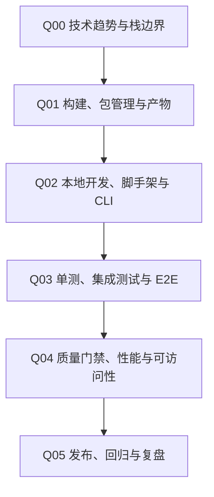

# 前端工程化与质量

## 知识点入口

- 本模块先看宏观流程，再看文章：[流程化知识点总览](核心知识点/流程化知识点总览.md)。
- 新文章必须先归入流程节点，再判断是补充、冲突、不同层次还是降权。
- `文章/` 只保留原文锚点，长期知识必须沉淀到 `核心知识点/`。

## 这个目录记录什么

这个文件记录前端工程化的横切能力：构建、测试、质量门禁、性能、发布、回归和趋势判断。

它和 `0703_工程实践与质量保障` 的边界是：如果主问题是前端项目如何验证和交付，留在这里；如果主问题是跨后端/平台/接口/安全的通用工程保障，归 `0703`。

## 前端工程化流程

## 流程节点与当前沉淀

| 节点 | 这个节点要解决什么 | 当前来源 | 当前沉淀 |
|---|---|---|---|
| Q00 技术趋势与栈边界 | 趋势文章是否改变选型判断 | Web 前端 8 个趋势 | 只作为略读，不能直接形成结论 |
| Q01 构建、包管理与产物 | 构建产物、依赖、包体和环境如何治理 | 当前缺来源 | 后续补 Vite、pnpm、bundle、monorepo |
| Q02 本地开发、脚手架与 CLI | CLI 工具如何打包、安装和验证 | CLI E2E 测试体系 | 候选实践沉淀 |
| Q03 单测、集成测试与 E2E | 测试输入、断言、隔离和清理怎么做 | CLI E2E 测试体系 | 有可运行链路，优先精读 |
| Q04 质量门禁、性能与可访问性 | 质量如何进入 CI 和发布前检查 | 当前缺来源 | 后续补质量门禁 |
| Q05 发布、回归与复盘 | 发布后怎么回滚和复盘 | 当前缺来源 | 后续补真实发布案例 |

## 新文章路由速查

| 文章主问题 | 优先路由节点 |
|---|---|
| 前端趋势、技术栈迁移 | Q00 |
| Vite、Webpack、pnpm、Monorepo、Bundle | Q01 |
| 脚手架、CLI、模板、开发服务 | Q02 |
| Playwright、Vitest、E2E、可视化回归 | Q03 |
| 性能预算、Lint、类型检查、可访问性 | Q04 |
| CI/CD、灰度、回滚、事故复盘 | Q05 |

## 当前明显缺口

| 缺口 | 为什么重要 |
|---|---|
| 构建和包体治理 | 前端工程化不能只讲框架趋势 |
| 可视化回归和可访问性 | 质量不只等于代码扫描 |
| 发布和回滚 | 缺上线闭环就不能支撑真实项目 |
| 与 0703 的边界 | 测试文章容易从前端滑向通用工程质量，需要按主问题判断 |
