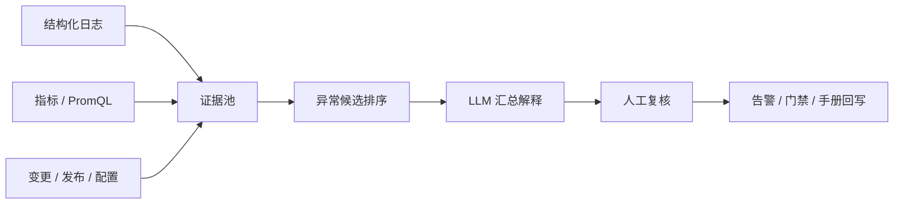

# 结构化日志与 LLM RCA 证据边界

## 来源

- [structlog，结构化日志解决方案](../文章/done-structlog，结构化日志解决方案！.md)
- [京东零售海量日志数据处理实践](../文章/done-王晶晶：京东零售海量日志数据处理实践.md)
- [Grafana Loki 的介绍](../文章/done-Grafana Loki 的介绍.md)
- [重塑 Prometheus 核心：揭开 PromQL 的面纱](../文章/done-重塑 Prometheus 核心：揭开 PromQL 的面纱.md)
- [LLM 做 RCA 可行性探索](../文章/done-AIOps探索：尝试用LLM做根因分析（RCA）的可行性探索.md)
- [生产系统巡检机器人](../文章/done-2句话打造你的第一个生产系统巡检机器人.md)
- [NetScaler 巡检平台](../文章/done-Citrix Netscaler全自动巡检平台，再也不用点点点啦！又省了2小时摸鱼时间.md)

## 核心问题

可观测性文章容易把“平台、图表、机器人、LLM 分析”当成结果。真正要沉淀的是证据链：日志字段、指标语义、告警窗口、变更记录、候选排序和人工复核。

## 判断准则

| 环节 | 准则 |
|---|---|
| 结构化日志 | 日志必须有稳定字段：时间、服务、实例、请求 ID、用户/租户、错误码、耗时、关键业务维度 |
| 日志检索 | Loki/日志平台价值在标签选择、查询成本、上下文关联和告警可用性，不是只接入 UI |
| 指标与 PromQL | PromQL 是指标查询语言，能表达趋势、窗口、聚合和比率，但不能单独证明根因 |
| 巡检机器人 | 巡检脚本要输出结构化结果、阈值、异常项和证据锚点；“两句话生成机器人”只能算原型 |
| LLM RCA | LLM 只能基于输入证据总结和排序候选，不能凭语言流畅度替代因果证明 |
| 复盘回写 | RCA 结果必须回写告警规则、日志字段、检查脚本、门禁或排障手册 |

## RCA 证据链

## 认知偏差

| 常见错误认知 | 正确理解 |
|---|---|
| 日志平台接上就能 RCA | 没有稳定字段和上下文关联，日志只是文本堆 |
| PromQL 查询结果就是根因 | 指标只能支持异常和相关性，根因需要变更、链路和业务上下文 |
| LLM 能自动定位根因 | LLM 更适合证据汇总、候选解释和报告生成，不能越过证据推断 |
| 巡检脚本等于可观测体系 | 巡检是补充信号，仍要纳入指标、日志、告警和复盘闭环 |

## 待验证缺口

- 需要真实日志字段样本验证哪些字段能支撑排障。
- LLM RCA 需要固定输入证据、禁止推断区域、候选置信度和人工确认流程。
- Prometheus/Grafana/Loki 的版本资讯需要官方补证后再进入版本记录。
