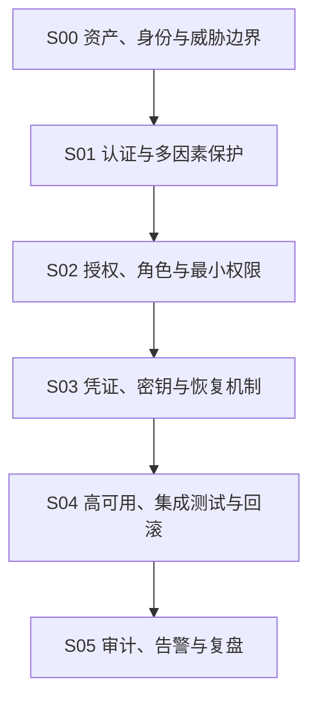

# 安全权限

## 知识点入口

- 本模块先看宏观流程，再看文章：[知识地图](070302_核心知识点/知识地图.md)。
- 新文章必须先归入流程节点，再判断是补充、冲突、不同层次还是降权。
- `文章/` 只保留原文锚点，长期知识必须沉淀到 `070302_核心知识点/`。

## 这个目录记录什么

这个文件是认证、授权、2FA、LDAP、凭证和审计边界的流程入口。

重点不是“安全工具怎么配”，而是权限边界如何定义、验证、审计、回滚和撤销。

## 安全权限流程

## 流程节点与当前沉淀

| 节点 | 这个节点要解决什么 | 当前来源 | 当前沉淀 |
|---|---|---|---|
| S00 资产、身份与威胁边界 | 保护什么身份、系统和凭证 | 当前缺来源 | 后续补威胁模型 |
| S01 认证与多因素保护 | 账号如何证明身份，2FA 如何降低风险 | GitHub 2FA | 候选精读 |
| S02 授权、角色与最小权限 | 谁能访问什么资源 | LDAP/CDP | 平台特定，需抽通用权限边界 |
| S03 凭证、密钥与恢复机制 | token、密钥、恢复码如何保存和撤销 | GitHub 2FA | 需要补恢复和撤销边界 |
| S04 高可用、集成测试与回滚 | 权限系统故障时如何保证可用和可恢复 | LDAP 高可用 | 候选精读 |
| S05 审计、告警与复盘 | 权限变更和异常如何追踪 | 当前缺来源 | 后续补审计 |

## 当前明显缺口

| 缺口 | 为什么重要 |
|---|---|
| 威胁模型 | 没有威胁模型就容易只停留在配置步骤 |
| 凭证治理 | 2FA 和 LDAP 都涉及恢复、撤销和审计 |
| 审计证据 | 安全结论必须能追踪谁在何时做了什么 |
