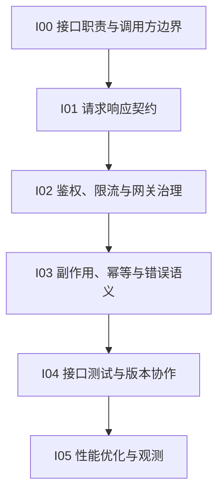

# 接口契约与网关

## 知识点入口

- 本模块先看宏观流程，再看文章：[知识地图](070304_核心知识点/知识地图.md)。
- 新文章必须先归入流程节点，再判断是补充、冲突、不同层次还是降权。
- `文章/` 只保留原文锚点，长期知识必须沉淀到 `070304_核心知识点/`。

## 这个目录记录什么

这个文件是接口契约、API 网关、接口优化和 API 测试协作的流程入口。

重点不是收藏 API 工具，而是回答：接口如何定义输入输出、错误语义、副作用、超时重试、鉴权限流、测试回归和性能边界。

## 接口保障流程

## 流程节点与当前沉淀

| 节点 | 这个节点要解决什么 | 当前来源 | 当前沉淀 |
|---|---|---|---|
| I00 接口职责与调用方边界 | API 面向谁，SPI 面向谁，谁能扩展谁 | SPI/API 文章 | SPI 是扩展点，API 是调用契约，后续和 Java SPI 排重 |
| I01 请求响应契约 | 输入、输出、错误码、版本如何稳定 | Postman 替代工具、UnoAPI | 工具只有进入契约管理才有价值 |
| I02 鉴权、限流与网关治理 | Gateway 如何处理认证、路由、限流、模型供应商抽象 | AI Gateway | AI Gateway 候选精读，需补官方证据 |
| I03 副作用、幂等与错误语义 | 重试、超时、重复提交、失败语义怎么约束 | 当前缺来源 | 后续重点补 |
| I04 接口测试与版本协作 | API 测试如何和 Git、契约、回归结合 | API 测试工具 | 候选略读，避免工具清单化 |
| I05 性能优化与观测 | 接口慢在哪里，怎么验证优化有效 | 京东接口优化 | 性能数字必须补基线、规模和副作用 |

## 新文章路由速查

| 文章主问题 | 优先节点 |
|---|---|
| API、SPI、扩展点、接口职责 | I00 |
| OpenAPI、契约、错误码、版本 | I01 |
| API Gateway、AI Gateway、限流、鉴权 | I02 |
| 幂等、重试、超时、副作用 | I03 |
| Postman、API 测试、接口回归 | I04 |
| 接口性能、慢接口优化 | I05 |

## 当前明显缺口

| 缺口 | 为什么重要 |
|---|---|
| 契约测试 | 现在多是工具和概念，还不能指导 API 变更门禁 |
| 错误语义和副作用 | 接口可靠性核心还缺资料 |
| 网关治理证据 | AI Gateway 文章需要补限流、审计、观测和供应商降级证据 |
