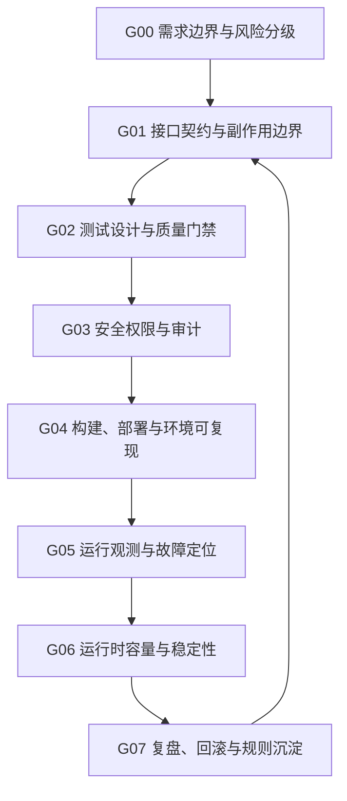

# 工程实践与质量保障

## 知识点入口

- 本模块先看宏观流程，再看文章：[知识地图](070300_核心知识点/知识地图.md)。
- 新文章必须先归入具体工程路线，再判断是补充、冲突、不同层次还是降权。
- `文章/` 根目录不再作为长期入口；文章锚点放到具体路线目录的 `文章/` 下。

## 目录目的

本目录只承载软件系统上线前后的横切工程保障能力。

它不再作为“工程类杂物池”。如果文章主问题是前端框架、AI 编程工具、数据平台、OLAP/数据库、BI 分析或电脑工具，必须按技术本体迁出。

每个路线目录的 `AGENTS.md` 都应该回答：

1. 该工程路线解决系统交付链路中的哪个问题。
2. 每篇文章优化哪个流程节点。
3. 当前沉淀是补充、冲突、不同层次还是降权。
4. 是否有可验证、可排障、可迁移的证据。
5. 文章文件只放在对应路线目录的 `文章/` 下，长期知识进入 `070300_核心知识点/`。

## 类目定位

| 项 | 内容 |
|---|---|
| 一级类目 | 工程与架构 |
| 二级类目 | 工程实践与质量保障 |
| 核心问题 | 软件系统上线前后如何建立接口契约、测试质量、安全权限、部署环境、运行观测和运行时稳定性保障 |
| 不解决什么 | 前端框架、后端语言路线、AI 编程工具、数据工程平台、OLAP/数据库、个人电脑工具和分析方法 |
| 用户当前认知假设 | 以 [用户画像.md](../../用户画像.md) 为准；重点补验证指标、失败模式、排障路径、权限边界和回滚动作 |

## 工程路线

| 路线 | 流程入口 | 当前文章数 | 当前状态 |
|---|---|---:|---|
| 接口契约与网关 | [接口契约与网关/AGENTS.md](070304_接口契约与网关/AGENTS.md) | 6 | 覆盖 AI Gateway、API 工具、接口优化、SPI/API 边界和前后端分离接口规范；需要补契约测试和错误语义 |
| 测试质量 | [测试质量/AGENTS.md](070305_测试质量/AGENTS.md) | 11 | 覆盖 AI 测试技能、流量回放、测试报告、决策表、压测、测试基础设施和 AI 测试平台；当前是最高优先级精读池 |
| 安全权限 | [安全权限/AGENTS.md](070302_安全权限/AGENTS.md) | 2 | 覆盖 LDAP 高可用集成和 GitHub 2FA；需要补威胁模型、审计和凭证治理 |
| 部署发布与环境 | [部署发布与环境/AGENTS.md](070306_部署发布与环境/AGENTS.md) | 2 | 覆盖 DockerHub 拉取和 Docker 策略变化；需要补镜像、配置、回滚和环境可复现 |
| 可观测性与 AIOps | [可观测性与AIOps/AGENTS.md](070301_可观测性与AIOps/AGENTS.md) | 7 | 覆盖日志、Prometheus/PromQL、RCA、AIOps；已有极简异常检测核心知识点 |
| 并发运行时 | [并发运行时/AGENTS.md](070303_并发运行时/AGENTS.md) | 1 | 当前只有 ThreadPoolExecutor；后续补线程池、事件循环、协程和资源隔离 |

## 统一工程保障流程



## 路线边界

| 文章主问题 | 应进入 | 不应进入 |
|---|---|---|
| API Gateway、接口契约、SPI/API、接口性能、API 测试协作 | `接口契约与网关` | 纯 Postman 类工具清单、后端语言框架入门 |
| 测试设计、流量回放、E2E、压测、测试报告、质量平台 | `测试质量` | 前端组件测试、AI 编程工具规则、单纯工具发布 |
| 认证、授权、2FA、LDAP、凭证、审计、权限边界 | `安全权限` | Agent 沙箱权限应进 `02_Agent与AI工程/0210_安全与权限` |
| Docker、镜像、部署环境、配置、灰度、回滚 | `部署发布与环境` | 个人电脑工具安装和 IDE 发布资讯 |
| 日志、指标、链路、Prometheus、RCA、AIOps | `可观测性与AIOps` | 数据平台日志 ETL 或纯数据处理文章 |
| 线程池、事件循环、协程、资源隔离、运行时调度 | `并发运行时` | 数据库存储引擎 WAL/MemTable、具体语言入门语法 |

## 本轮目录纠偏

| 迁出方向 | 处理 |
|---|---|
| 前端工程 | Ant Design AI、ESLint、Flutter 版本、Web Install API、TypeScript 文章迁到 `0702_前端工程` |
| 后端架构 | Bun、Python 动态导入、Python 抽象基类、JeecgBoot 迁到 `0701_后端架构` |
| Agent 与 AI 工程 | Codex、OpenSpec、Petri、LangChain、Tavily、Hermes、Flutter Skill 等迁到 `02_Agent与AI工程` |
| 数据工程与数仓 | Amoro、Hybrid Shuffle、Fluss、AllData 迁到对应数据工程目录 |
| OLAP 与数据库 | WAL/MemTable、binlog/redolog/undolog 迁到存储引擎或 MySQL |
| 数据分析与 BI / 机器学习 | AB 测试、连续登录分析、时序预测、AntV G6 迁到对应分析/可视化/预测目录 |
| 电脑工具 / 低置信删除 | VSCode、Visual Studio、JupyterLab、打工助手迁到电脑工具；DataFun 知识地图不进入正式工程目录，只保留路由判断 |

## 新文章进入时的处理流程

```text
文章主问题
  -> 工程路线: 接口契约 / 测试质量 / 安全权限 / 部署发布 / 可观测性 / 并发运行时
  -> 流程节点: 对应路线 AGENTS.md 中的节点
  -> 读取节点已有沉淀
  -> 读取对应核心知识点
  -> 判断补充 / 冲突 / 不同层次 / 更好的方式 / 低价值
  -> 更新核心知识点和 AGENTS 节点
```

## 当前补证优先级

| 优先级 | 方向 | 原因 |
|---|---|---|
| P0 | 测试质量 | 文章最多，且可形成可运行、可验证、可排障的实践准则 |
| P0 | 可观测性与 AIOps | 已有核心知识点，需要继续补 Prometheus、日志和 LLM RCA 证据约束 |
| P1 | 接口契约与网关 | AI Gateway 和接口优化容易被标题夸大，需要抽契约、副作用和错误语义 |
| P1 | 安全权限 | 文章少但风险高，需要补威胁模型、凭证隔离和审计 |
| P2 | 部署发布与环境、并发运行时 | 当前文章少，先保留路线，等待更高质量来源 |
