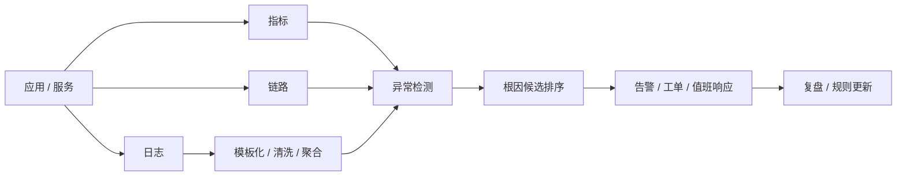

# AIOps
## 知识点入口

- 本模块先看宏观流程，再看文章：[流程化知识点总览](knowledge/07_工程与架构/0703_工程实践与质量保障/AIOps/核心知识点/流程化知识点总览.md)。
- 新文章必须先归入流程节点，再判断是补充、冲突、不同层次还是降权。
- `文章/` 只保留原文锚点，长期知识必须沉淀到 `核心知识点/`。

## 技术定位

| 项 | 内容 |
|---|---|
| 技术名 | AIOps |
| 一级类目 | 工程与架构 |
| 二级类目 | 工程实践与质量保障 |
| 技术本体 | 用日志、指标、链路、事件和算法辅助故障发现、异常检测、告警降噪和根因定位 |
| 全局架构位置 | 位于业务系统与运维响应之间，连接可观测数据采集、异常检测、告警、诊断和处置流程 |
| 主要使用者 | SRE、平台工程师、后端工程师、运维团队 |
| 主要产出 | 异常告警、根因候选、事件聚合、处置建议、复盘证据 |

## 架构图

## 核心模块

| 模块 | 职责 | 重点问题 |
|---|---|---|
| 数据采集 | 获取日志、指标、链路、事件 | 覆盖率、延迟、采样、成本 |
| 数据标准化 | 日志模板化、字段抽取、服务拓扑归一 | 噪声、模板质量、维度爆炸 |
| 异常检测 | 识别时间窗口内的异常变化 | 阈值、季节性、误报、漏报 |
| 根因候选 | 从异常出现时间、变化幅度、拓扑关系排序 | 不要把相关性直接当因果 |
| 处置闭环 | 告警、工单、复盘、规则回写 | 可解释性、可操作性、证据保留 |

## 横向对标

| 对标技术 | 对标点 | AIOps 优势 | AIOps 劣势 | 使用判断 |
|---|---|---|---|---|
| 传统阈值告警 | 异常发现 | 实现简单、可解释 | 噪声大、难处理复杂模式 | 基础监控先保留阈值 |
| 极简异常检测 | 变化幅度和出现时间 | 落地快、解释清楚 | 对复杂链路因果覆盖弱 | 初期优先落地 |
| 全链路因果推断 | 根因定位 | 理论上更完整 | 数据要求高、建设周期长、容易不稳定 | 有高质量拓扑和数据后再做 |
| LLM RCA | 总结和辅助诊断 | 能整合日志、变更、文档 | 容易编造因果，需要证据约束 | 作为辅助分析，不作为单点判定 |

## 已沉淀核心知识点

| 主题 | 文件 | 问题指纹 | 解决什么问题 | 认知增量 |
|---|---|---|---|---|
| 极简异常检测优先 | [极简异常检测优先于全链路因果](核心知识点/极简异常检测优先于全链路因果.md) | AIOps + 日志异常检测 + 时间窗口/历史基线 + 根因候选 + 不证明因果 | AIOps 根因分析从哪里开始最务实 | 把“根因分析”校准为“先输出可解释候选，再人工确认” |

## 后续追查

- 日志模板化质量如何影响异常检测。
- 异常窗口、历史窗口、变化阈值如何设置。
- LLM 在 RCA 中如何只做证据整合，不做无证据推断。
