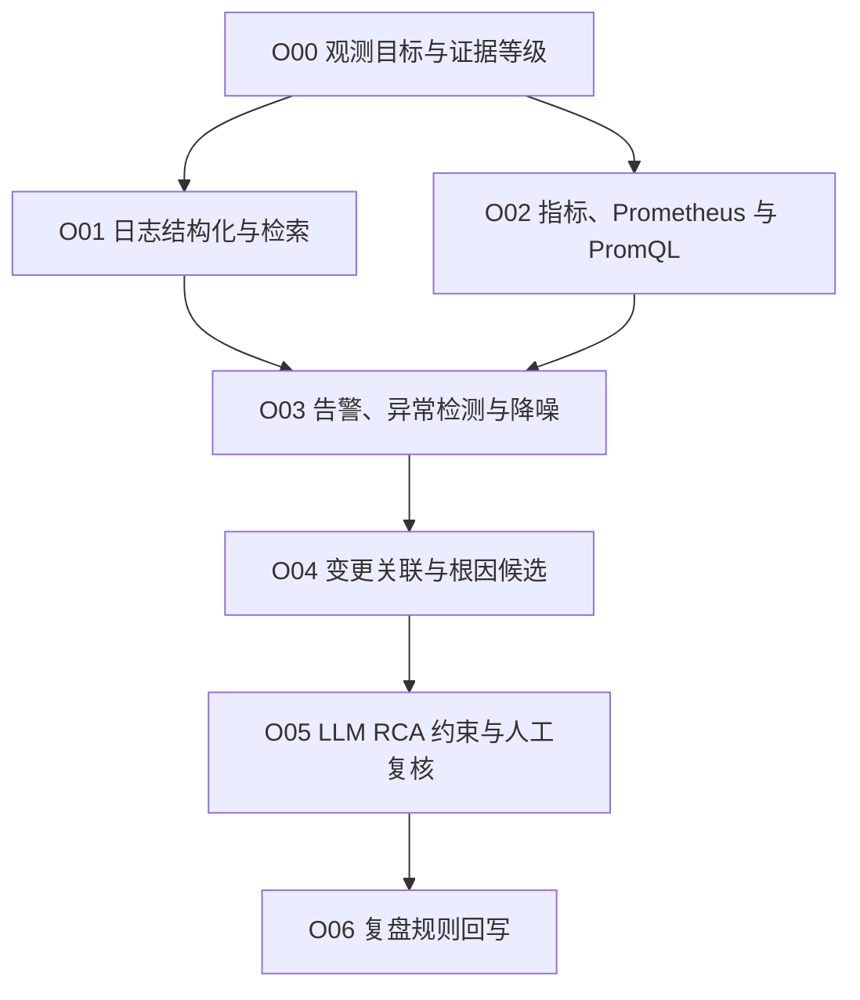

# 可观测性与 AIOps

## 知识点入口

- 本模块先看宏观流程，再看文章：[流程化知识点总览](核心知识点/流程化知识点总览.md)。
- 已沉淀核心知识点：[极简异常检测优先于全链路因果](核心知识点/极简异常检测优先于全链路因果.md)。
- 新文章必须先归入流程节点，再判断是补充、冲突、不同层次还是降权。
- `文章/` 只保留原文锚点，长期知识必须沉淀到 `核心知识点/`。

## 这个目录记录什么

这个文件是日志、指标、链路、告警、Prometheus、PromQL、RCA 和 AIOps 的流程入口。

核心判断：可观测性先提供证据，AIOps 只能做根因候选排序；不能把相关性、模型解释或工具输出直接写成因果结论。

## 可观测流程

## 流程节点与当前沉淀

| 节点 | 这个节点要解决什么 | 当前来源 | 当前沉淀 |
|---|---|---|---|
| O00 观测目标与证据等级 | 哪些信号能作为事实，哪些只是候选 | AIOps 核心知识点 | 已沉淀“极简异常检测优先” |
| O01 日志结构化与检索 | 日志如何结构化、聚合和检索 | structlog、京东日志实践 | 候选精读 |
| O02 指标、Prometheus 与 PromQL | 指标怎么采集、查询和告警 | Prometheus 3.0、PromQL | 发布资讯降权，PromQL 候选精读 |
| O03 告警、异常检测与降噪 | 如何发现异常而不误报 | AIOps 极简异常检测 | 已有核心知识点 |
| O04 变更关联与根因候选 | 异常和变更如何关联 | AIOps/RCA 文章 | 只能输出候选，不直接判因果 |
| O05 LLM RCA 约束与人工复核 | LLM 如何辅助 RCA | LLM RCA 文章 | 需补证据约束 |
| O06 复盘规则回写 | 事故如何变成告警、门禁或规则 | 当前缺来源 | 后续补 |

## 新文章路由速查

| 文章主问题 | 优先节点 |
|---|---|
| 日志、结构化日志、日志平台 | O01 |
| Prometheus、PromQL、指标查询 | O02 |
| 告警、异常检测、降噪 | O03 |
| RCA、变更关联、根因分析 | O04 |
| LLM RCA、AIOps Agent | O05 |
| 事故复盘、规则回写 | O06 |

## 当前明显缺口

| 缺口 | 为什么重要 |
|---|---|
| 日志模板化和字段治理 | 没有结构化信号，RCA 和检索都会不稳定 |
| 告警降噪 | AIOps 不能只做事后解释 |
| LLM RCA 证据约束 | 必须防止模型把猜测写成根因 |
