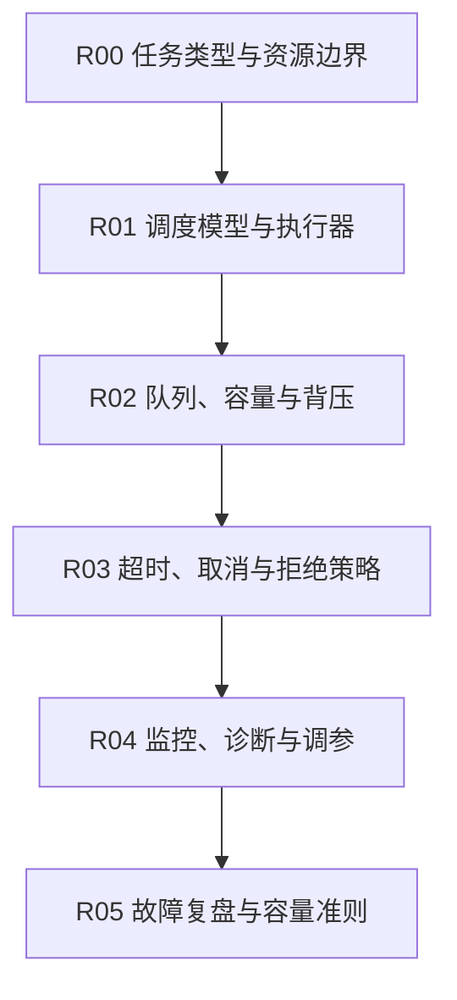

# 并发运行时

## 知识点入口

- 本模块先看宏观流程，再看文章：[流程化知识点总览](核心知识点/流程化知识点总览.md)。
- 新文章必须先归入流程节点，再判断是补充、冲突、不同层次还是降权。
- `文章/` 只保留原文锚点，长期知识必须沉淀到 `核心知识点/`。

## 这个目录记录什么

这个文件是线程池、事件循环、协程、任务调度、资源隔离和运行时稳定性的流程入口。

当前只有 ThreadPoolExecutor 文章，因此先建立运行时路线，后续补 Java/Python/Node 等运行时机制。

## 并发运行时流程

## 流程节点与当前沉淀

| 节点 | 这个节点要解决什么 | 当前来源 | 当前沉淀 |
|---|---|---|---|
| R00 任务类型与资源边界 | CPU、IO、阻塞、异步任务如何区分 | 当前缺来源 | 后续补任务分类 |
| R01 调度模型与执行器 | 线程池、事件循环、协程怎么调度任务 | ThreadPoolExecutor | 候选精读 |
| R02 队列、容量与背压 | 队列大小、核心线程数、最大线程数如何影响稳定性 | ThreadPoolExecutor | 重点抽容量边界 |
| R03 超时、取消与拒绝策略 | 任务堆积和超时时如何保护系统 | ThreadPoolExecutor | 重点抽拒绝策略 |
| R04 监控、诊断与调参 | 如何发现线程池耗尽、排队和阻塞 | 当前缺来源 | 后续补指标 |
| R05 故障复盘与容量准则 | 故障后如何形成容量规则 | 当前缺来源 | 后续补复盘 |

## 当前明显缺口

| 缺口 | 为什么重要 |
|---|---|
| 任务分类 | 不区分任务类型就无法设置线程池 |
| 运行时指标 | 没有队列长度、活跃线程、拒绝次数就无法排障 |
| 跨语言对比 | Java 线程池、Python 协程、Node 事件循环需要横向对比 |
