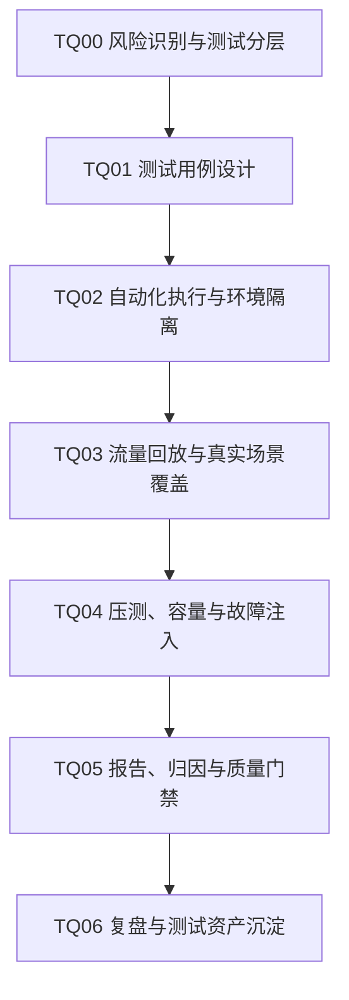

# 测试质量

## 知识点入口

- 本模块先看宏观流程，再看文章：[流程化知识点总览](核心知识点/流程化知识点总览.md)。
- 新文章必须先归入流程节点，再判断是补充、冲突、不同层次还是降权。
- `文章/` 只保留原文锚点，长期知识必须沉淀到 `核心知识点/`。

## 这个目录记录什么

这个文件是测试设计、自动化测试、流量回放、压测、测试报告和测试基础设施的流程入口。

重点不是工具列表，而是测试如何形成可复现输入、稳定断言、环境隔离、失败信号、质量门禁和复盘闭环。

## 测试质量流程

## 流程节点与当前沉淀

| 节点 | 这个节点要解决什么 | 当前来源 | 当前沉淀 |
|---|---|---|---|
| TQ00 风险识别与测试分层 | 单测、集成、E2E、性能、安全分别测什么 | AI 测试技能、测试人 Skill | 技能清单降权，后续抽测试分类准则 |
| TQ01 测试用例设计 | 输入条件、业务规则、断言和覆盖如何设计 | 决策表文章 | 决策表是候选正式沉淀 |
| TQ02 自动化执行与环境隔离 | Pytest、Playwright、Groovy 脚本如何安全执行 | pytest、Spring Boot + Playwright | AI 生成用例必须有断言和隔离 |
| TQ03 流量回放与真实场景覆盖 | 线上流量如何脱敏、回放、对比和验收 | 流量回放文章 | 候选正式沉淀 |
| TQ04 压测、容量与故障注入 | 压测工具、容量模型、故障注入怎么设计 | 百度压测、AutoMQ 测试基础设施 | 工具标题降权，重点看模型和基础设施 |
| TQ05 报告、归因与质量门禁 | 测试报告如何变成可行动门禁 | ReportPortal | 平台文章需抽失败归因和趋势 |
| TQ06 复盘与测试资产沉淀 | 缺陷如何回流用例、门禁和规则 | 当前缺来源 | 后续补事故/缺陷复盘 |

## 新文章路由速查

| 文章主问题 | 优先节点 |
|---|---|
| 测试策略、测试分类、质量体系 | TQ00 |
| 决策表、等价类、边界值、用例生成 | TQ01 |
| Pytest、Playwright、JUnit、自动化脚本 | TQ02 |
| 流量回放、录制回放、线上对照 | TQ03 |
| 压测、容量、故障注入、稳定性测试 | TQ04 |
| 测试报告、失败归因、质量门禁 | TQ05 |
| 复盘、测试资产治理 | TQ06 |

## 当前明显缺口

| 缺口 | 为什么重要 |
|---|---|
| 测试分层决策 | 目前文章多是工具或案例，缺“什么时候测哪一层” |
| 失败信号标准 | 自动化测试不能只有脚本，还要有可解释失败 |
| 测试资产沉淀 | 缺陷没有回流规则就会反复发生 |
