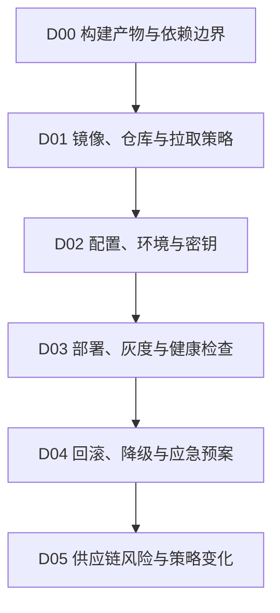

# 部署发布与环境

## 知识点入口

- 本模块先看宏观流程，再看文章：[流程化知识点总览](核心知识点/流程化知识点总览.md)。
- 新文章必须先归入流程节点，再判断是补充、冲突、不同层次还是降权。
- `文章/` 只保留原文锚点，长期知识必须沉淀到 `核心知识点/`。

## 这个目录记录什么

这个文件是镜像、构建产物、部署环境、配置、灰度、回滚和供应链风险的流程入口。

当前来源只有 DockerHub 拉取和 Docker 策略变化，因此先作为部署环境路线入口，后续需要补真实 CI/CD、配置、发布和回滚资料。

## 部署环境流程

## 流程节点与当前沉淀

| 节点 | 这个节点要解决什么 | 当前来源 | 当前沉淀 |
|---|---|---|---|
| D00 构建产物与依赖边界 | 产物如何可复现、可追踪 | 当前缺来源 | 后续补 CI/CD |
| D01 镜像、仓库与拉取策略 | 镜像源不可用时如何兜底 | DockerHub 拉取 | 候选精读 |
| D02 配置、环境与密钥 | 配置和环境变量如何隔离 | 当前缺来源 | 后续补配置治理 |
| D03 部署、灰度与健康检查 | 如何上线和验证 | 当前缺来源 | 后续补发布流程 |
| D04 回滚、降级与应急预案 | 失败后如何恢复 | 当前缺来源 | 后续补回滚 |
| D05 供应链风险与策略变化 | 上游收费/策略变化如何影响工程依赖 | Docker 收费撤回 | 资讯略读 |

## 当前明显缺口

| 缺口 | 为什么重要 |
|---|---|
| CI/CD 与发布策略 | 当前不能指导真实上线 |
| 回滚和应急预案 | 部署文章不能只停留在镜像拉取 |
| 配置与密钥治理 | 环境可复现需要配置边界 |
