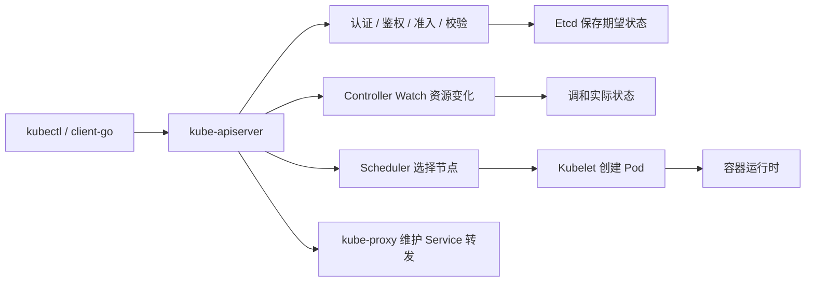

# K8s 与 Docker 容器化核心知识点

## 来源

- [2万字长文带你一文了解 Kubernetes](../文章/done-2万字长文带你一文了解 Kubernetes.md)
- [DockerHub 拉取镜像，终极解决方案](../文章/done-DockerHub 拉取镜像，终极解决方案！.md)
- [Docker Free Team 策略撤回](../文章/done-Docker正式发公告了，撤回之前的收费方案.md)

## 一句话结论

容器化文章不要停在 YAML、命令和平台资讯上；长期有价值的是两条主线：Kubernetes 的声明式控制循环，以及 Docker 镜像供应链的可用性兜底。

## 认知校准点

| 校准点 | 处理 |
|---|---|
| Kubernetes 不是“部署脚本集合” | 重点看 API Server、Etcd、Controller、Scheduler、Kubelet、Service/Proxy 如何围绕期望状态工作 |
| DockerHub 拉取方案不是单纯命令技巧 | 它暴露的是外部镜像源不可用时，私有 Registry、镜像同步、凭证和供应链审计怎么兜底 |
| Docker 订阅策略资讯不能直接沉淀成技术结论 | 只保留为平台策略风险锚点，真正要沉淀的是镜像资产不能只依赖单一托管平台 |

## Kubernetes 控制循环

| 组件 | 稳定理解 |
|---|---|
| kube-apiserver | 唯一 API 入口，负责认证、鉴权、准入、版本转换和持久化入口 |
| Etcd | 集群状态存储，不应被业务组件绕过访问 |
| Controller | 通过 Watch 感知变化，把实际状态调和到期望状态 |
| Scheduler | 根据 Pod 需求和节点状态做调度决策 |
| Kubelet | 节点代理，按 Pod 规格调用容器运行时 |
| kube-proxy | 维护 Service 到 Pod 的转发关系 |

## Docker 镜像供应链兜底

| 环节 | 准则 |
|---|---|
| 镜像来源 | 记录镜像来源、版本、摘要和同步时间，避免只写 `latest` |
| 私有 Registry | 作为 DockerHub 不可用、限流或政策变化时的兜底，不应裸奔暴露在公网 |
| 同步流水线 | GitHub Actions 等外部流水线可以同步镜像，但要保护凭证和审计执行记录 |
| 拉取配置 | `registry-mirrors` 和 `insecure-registries` 是临时可用性手段，不是供应链安全方案 |
| 风险复盘 | 平台订阅、限流、下架策略变化要转成镜像备份和替代源规则 |

## 待补缺口

| 缺口 | 后续文章进入时怎么判断 |
|---|---|
| Deployment/StatefulSet/Job/DaemonSet 适用边界 | 是否说明工作负载状态、调度方式、升级和回滚差异 |
| Request/Limit 与 OOMKilled | 是否有资源指标、告警和容量推导 |
| Liveness/Readiness/Startup Probe | 是否说明探针误配导致的流量中断或重启风暴 |
| 镜像签名、SBOM、漏洞扫描 | 是否能把镜像供应链从“可拉取”推进到“可审计、可追责” |
