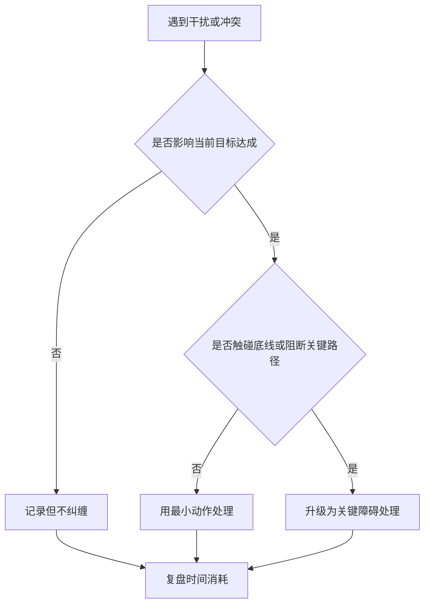

# 职业发展-晋升影响力与组织交换

## 来源

- [Webflow产品VP Jessica——所有人都在想怎么_说服_领导，真拿到资源的人从不这么干（上篇）](../文章/done-Webflow产品VP Jessica——所有人都在想怎么_说服_领导，真拿到资源的人从不这么干（上篇）.md)
- [普通人晋升最大的误区，是以为“胜任”就够了-Netflix奈飞 CTO- Elizabeth Stone](../文章/done-普通人晋升最大的误区，是以为“胜任”就够了-Netflix奈飞 CTO- Elizabeth Stone.md)
- [技术负责人给年轻人的忠告：将军赶路不追小兔，带过几十个骨干，最后成事的人都懂得这个道理](../文章/done-技术负责人给年轻人的忠告：将军赶路不追小兔，带过几十个骨干，最后成事的人都懂得这个道理.md)
- [从“腾讯13级程序员前辈分享的技术理解的三个层次”中获得的反思与总结](../文章/done-从“腾讯13级程序员前辈分享的技术理解的三个层次”中获得的反思与总结.md)
- [突破自我的三项修炼——深耕、破局与坚持](../文章/done-突破自我的三项修炼——深耕、破局与坚持.md)

## 核心问题

职业成长不是“胜任当前职责”自动换来晋升，而是持续把个人能力转成组织更愿意交换的资产：信任、信息、标准、问题定义、跨团队成果和可复用方法。

## 认知校准点

| 校准点 | 说明 |
|---|---|
| 影响力不是说服 | 影响力更像交换：你带来一线信息、可信判断、组织贡献、风险选项，对方才愿意把资源、信任或决策权交给你。 |
| 晋升不是只看“能做好” | “胜任”只证明你能完成现岗位；晋升需要证明你能提升团队标准、连接技术与业务、成就他人并处理更高复杂度。 |
| 目标感不是忍气吞声 | 不追干扰，是因为它不影响目标；真正阻断目标、触碰底线或破坏协作的障碍必须处理。 |
| 技术视野不等于技术成绩 | 视野只能修正想法；成绩来自回到系统本质、找到应用机会并连接生态。 |
| 组织文化不能照搬 | Netflix 的自由与责任依赖高人才密度；没有同等人才密度和反馈文化时，直接复制会失效。 |

## 组织交换模型

| 可交换资产 | 如何积累 | 可以换到什么 |
|---|---|---|
| 一线信息 | 直接接触用户、业务、系统、事故和数据 | 资源优先级、方案可信度、领导注意力。 |
| 信任记录 | 按时交付、主动暴露风险、闭环反馈 | 更高自由度、更大问题、更少过程控制。 |
| 判断框架 | 能解释方案边界、权衡和反例 | 决策参与权、评审话语权。 |
| 组织贡献 | 帮其他团队解决问题、沉淀方法、连接接口 | 跨团队影响力和晋升证据。 |
| 质量标准 | 设定预期、给具体反馈、帮助补差 | 团队整体产出水平和人才密度。 |

## 目标过滤

## 行动准则

| 场景 | 做法 |
|---|---|
| 向上争取资源 | 不只讲“我的方案好”，要给对方缺的信息、目标对齐关系、备选路径和风险边界。 |
| 面对反对意见 | 先问对方依据，从观点争论切到信息提取。 |
| 准备晋升材料 | 用代表作证明影响范围、组织贡献、复杂度、复用资产和结果，而不是罗列辛苦。 |
| 提升团队标准 | 先明确预期，再给具体反馈，最后帮助补齐差距。 |
| 技术成长 | 视野输入、系统本质、生态应用三层同时建设，避免“杂而不精”。 |

## 待验证缺口

- 需要把用户过去的项目复盘映射到“可交换资产”表，找出当前最弱的一项。
- 后续可补一份“晋升材料模板”，把代表作、影响范围、风险边界和组织贡献固定成字段。
