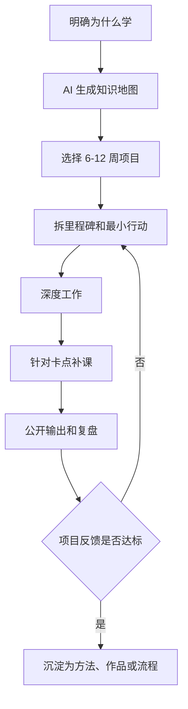

# 学习方法-AI辅助项目制学习

## 来源

- [油管大神Dan Koe：这样用AI学东西，速度快十几倍](../文章/done-油管大神Dan Koe：这样用AI学东西，速度快十几倍.md)
- [商业大神Dan Koe最新一期作品：2026真正的分水岭，最值钱的不在是知识！](../文章/done-商业大神Dan Koe最新一期作品：2026真正的分水岭，最值钱的不在是知识！.md)
- [一人公司大神Dan Koe亲授：如何在6-12个月拉开与99%同龄人的差距……](../文章/done-一人公司大神Dan Koe亲授：如何在6-12个月拉开与99%同龄人的差距…….md)

## 核心问题

AI 让资料获取和路径规划变便宜后，学习的稀缺点不再是“找到教程”，而是把学习绑定到一个可交付项目，并用反馈不断修正路径。

## 判断准则

| 学习环节 | 判断准则 | 边界 |
|---|---|---|
| 选择主题 | 先问这个能力服务什么生活、工作或作品目标 | 只因热门而学，容易变成收藏和刷课 |
| 建知识地图 | 让 AI 先列核心概念、子领域、路径和常见误区 | AI 地图只是导航，不是事实校验 |
| 做项目 | 选 6-12 周可交付作品，边做边补教程 | 没有项目，教程会变成低摩擦拖延 |
| 最小行动 | 卡住时拆成 15 分钟内可启动的动作 | 不用“等准备好”作为开工条件 |
| 复盘输出 | 每天记录学到什么、哪里没懂、明天先解决什么 | 输出不是表演，是暴露理解缺口 |

## 认知偏差

| 常见错误认知 | 正确理解 |
|---|---|
| 学得越多越安全 | 信息越便宜，越要警惕“仓库式学习”；真正有价值的是判定算法和可执行流程 |
| AI 可以替代学习 | AI 可以生成路线、拆项目和答疑，但不能替你选择目标、承受反馈和完成作品 |
| 先系统学完再动手 | 对工程和技能类学习，项目会逼出真实问题，反而能让学习路径更短 |
| 负面愿景只是焦虑 | 反向愿景可以作为启动能量，但不能替代目标、节奏和反馈闭环 |

## 流程图

## 待验证缺口

- 需要用用户自己的一个技术学习主题验证：AI 地图、项目拆解、每日复盘是否真的减少无效资料消耗。
- 需要区分“AI 辅助学习”和“AI 代写学习笔记”：后者容易掩盖未理解的问题。
