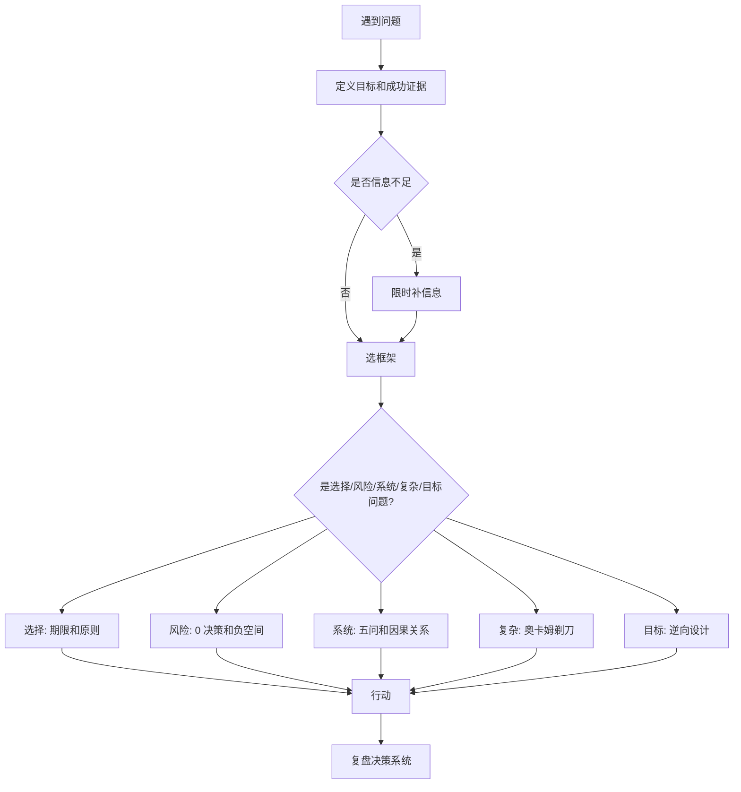

# 学习方法-决策与问题解决框架

## 来源

- [怎么提升“解决问题”的思维模式](../文章/done-怎么提升“解决问题”的思维模式.md)
- [这篇文章，解决你的选择困难症](../文章/done-这篇文章，解决你的选择困难症.md)
- [“0”的重要性：不决策也是一种决策](../文章/done-“0”的重要性：不决策也是一种决策.md)
- [所有问题的解法，都比问题高出一个维度](../文章/done-所有问题的解法，都比问题高出一个维度.md)
- [逆向设计：以终为始的思维范式](../文章/done-逆向设计：以终为始的思维范式.md)
- [程序员的底层思维：奥卡姆剃刀](../文章/done-程序员的底层思维：奥卡姆剃刀.md)

## 核心问题

复杂问题通常不是缺少努力，而是问题定义、思维层级、决策期限、系统边界和反馈机制错了。解决问题要从“多想一点”升级为“用合适框架逼近可行动答案”。

## 判断准则

| 场景 | 优先框架 | 判断方式 |
|---|---|---|
| 选择困难 | 决策期限 + 决策原则 | 信息足够后停止追加思考，复盘系统而不是后悔单次选择 |
| 隐性风险 | “0”决策 / 负空间 | 问没做什么、没出现什么、没表达什么，避免只奖励显性动作 |
| 反复失败 | 系统思维 + 五个为什么 | 从人、流程、工具、规则和反馈关系里找杠杆点 |
| 方案复杂 | 奥卡姆剃刀 | 如果少一个概念、流程、工具也能达成目标，就删除 |
| 目标模糊 | 逆向设计 | 先定义成功证据，再倒推路径和行动 |
| 低维纠缠 | 升维问题 | 问当前维度之上是否是战略、系统、长期价值或人性问题 |

## 认知偏差

| 常见错误认知 | 正确理解 |
|---|---|
| 犹豫说明更谨慎 | 信息足够后的犹豫常是逃避责任，应该给决策设期限 |
| 不做就没有决策 | 不做也是选择，也会产生机会成本和风险 |
| 多工具能解决复杂问题 | 工具可能增加认知负荷；复杂系统里要先删掉不必要实体 |
| 问题在执行层就只能从执行层解 | 有些问题要上升到目标、规则、组织或系统层才有解 |
| 复盘就是找错 | 复盘的重点是更新下一次决策系统，不是惩罚当时的自己 |

## 流程图

## 待验证缺口

- 需要在真实项目复盘中验证：哪些问题是执行层问题，哪些应上升到组织、系统或目标层。
- “升维”类文章容易变成大词，后续只保留能落到变量、证据、动作的用法。
