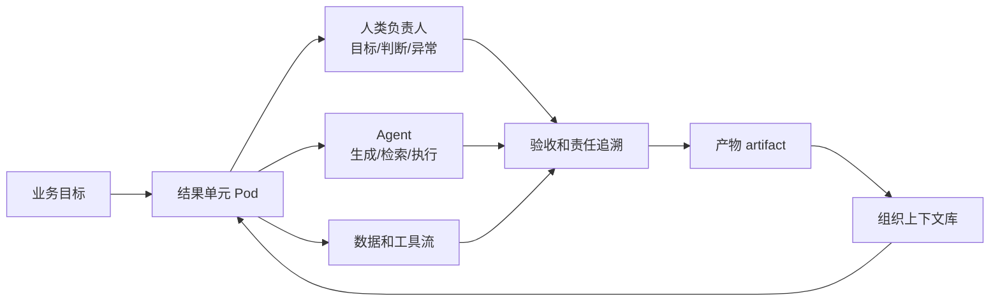

# 管理沟通-AI时代组织设计

## 来源

- [AI-native下组织形式思考](../文章/done-AI-native下组织形式思考.md)
- [YC 放出一套「AI-native 公司」组织方法论，直接把公司当操作系统来设计！中层管理变成了 markdown](../文章/done-YC 放出一套「AI-native 公司」组织方法论，直接把公司当操作系统来设计！中层管理变成了 markdown.md)

## 核心问题

AI 对组织的影响不是“每个员工多一个助手”，而是改变组织的责任中心、上下文容器、反馈闭环和人机分工方式。

## 判断准则

| 组织问题 | AI-native 判断 |
|---|---|
| 基本单位 | 从部门/岗位转向围绕结果负责的人机混合单元 |
| 管理对象 | 从管理人力转向治理智能、上下文、权限和责任 |
| 工作流 | 从开环任务流转转向可记录、可查询、可反馈的闭环系统 |
| 中层价值 | 从人肉传话和路由，转向定义约束、沉淀上下文、处理异常 |
| 扩张方式 | 招人前先问能否用 AI、自动化和流程重写放大现有能力 |

## 认知偏差

| 常见错误认知 | 正确理解 |
|---|---|
| AI-native 等于更多工具 | 重点是流程、数据、责任、权限和评价体系是否重写 |
| 中层会消失 | 低价值的人肉路由会减少，高价值的判断、约束和异常处理会更重要 |
| Agent 能自动反映人的心智模型 | Spec、测试、上下文和评审不足时，Agent 会漂移 |
| token 投入越多越先进 | token 要投向可验证闭环；否则只是把旧流程更快地自动化 |

## 组织流程图

## 待验证缺口

- 文章中涉及的组织案例和数字未联网补证，本轮只能作为组织形态假设，不作为当前事实。
- 后续需要结合真实团队流程验证：哪些会议、同步、审批可以变成可查询 artifact，哪些必须保留人类判断。
