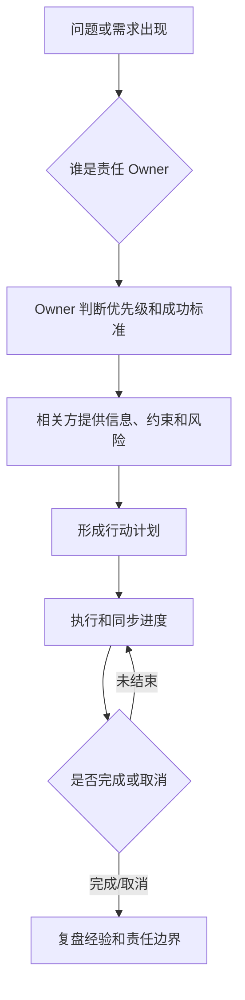

# 管理沟通-团队职责边界与协作闭环

## 来源

- [“业务优先”为何会反噬技术团队？——平衡与尊重才是健康组织的基石](../文章/done-“业务优先”为何会反噬技术团队？——平衡与尊重才是健康组织的基石.md)
- [字节员工吐槽：“我们组，一群不干活的人，把最忙的人拖进会里，听他们讨论怎么提高他的效率...”](../文章/done-字节员工吐槽：“我们组，一群不干活的人，把最忙的人拖进会里，听他们讨论怎么提高他的效率...”.md)
- [凡事有交代，件件有着落，事事有回音](../文章/done-凡事有交代，件件有着落，事事有回音.md)
- [20251028_ 关于团队管理的一些思考](../文章/done-20251028_ 关于团队管理的一些思考.md)
- [为何现在难再有“刘邦式的团队”](../文章/done-为何现在难再有“刘邦式的团队”.md)

## 核心问题

团队协作不是靠“谁更热心”维持，而是靠清晰职责、可信闭环、合理会议成本、结果导向和互相尊重的专业边界。

## 判断准则

| 场景 | 准则 | 风险 |
|---|---|---|
| 技术团队支撑业务 | 技术可提前提供信息和准备，但不能替产品/业务承担全局优先级判断 | 短期救火掩盖流程短板，长期累积技术债和责任转嫁 |
| 会议协作 | 会议必须改变决策、信息、风险或行动状态 | 为了“优化效率”消耗核心产出者的深度工作 |
| 任务闭环 | 任何被提出的事只有完成或取消两种结束方式 | 石沉大海会破坏信任 |
| 管理者角色 | 管理者要从一线信息抽象出中期规划、资源配置和团队分工 | 永远沉入事务，缺少方向和复盘 |
| 团队凝聚 | 现代团队更需要事实、目标、信任和利益机制支撑 | 只靠口号、同乡或情义很难长期协作 |

## 协作闭环

## 认知偏差

| 常见错误认知 | 正确理解 |
|---|---|
| 业务优先就是业务说什么技术做什么 | 业务优先要以全局目标、产品判断、技术可持续性和责任归属为边界 |
| 开会越多越重视 | 无决策、无信息增量、无行动改变的会议是在消耗组织 token |
| 可靠就是把想到的事做好 | 可靠还包括对没想到的事负责，及时暴露风险和闭环反馈 |
| 管理就是深入每个细节 | 管理要在一线信息和中期规划之间切换，不能只做超级执行者 |

## 待验证缺口

- 需要把用户真实团队中的会议、需求插队和跨团队协作案例映射到责任边界表。
- 技术团队与产品/业务的分工可与 `0801_职业发展/职业发展-数据岗位能力模型` 交叉引用。
