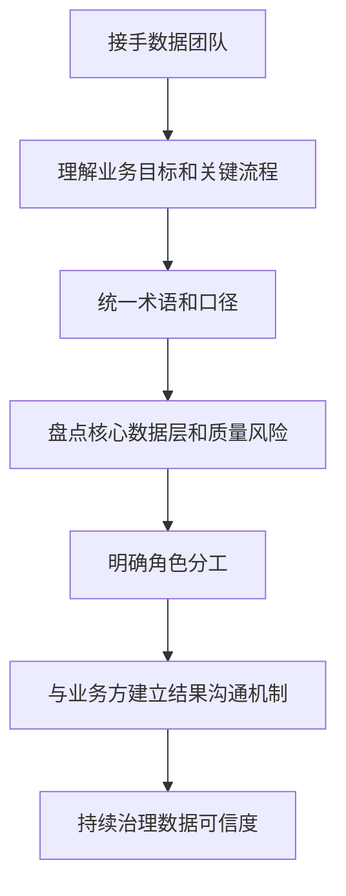

# 管理沟通-数据团队负责人方法

## 来源

- [如何接手一个数据团队？](../文章/done-如何接手一个数据团队？.md)

## 核心问题

数据团队负责人不能只管理技术栈和查询交付，而要建立业务理解、数据可信、角色分工、技术判断和管理层沟通之间的桥梁。

## 判断准则

| 领域 | 准则 | 风险 |
|---|---|---|
| 业务理解 | 数据负责人要理解行业流程、关键指标和业务目标 | 只懂数据层，会把现实问题误读成表字段问题 |
| 对外沟通 | 对业务讲功能组件、结果和影响，不讲工具清单 | 高管不关心 Kafka、S3、Airflow 的细节 |
| 数据质量 | 小错误会破坏信任，导致影子数据团队和口径分裂 | 可信度一旦丢失，中心数据团队权威会下降 |
| 技术选型 | 对供应商方法论保持怀疑，结合自身架构阶段判断 | 被“最佳实践”营销牵着走 |
| 角色分工 | 工程师建设核心数据层，分析师做最后一公里分析 | 分工不清会让核心资产和业务探索互相拖累 |

## 数据团队接手流程

## 认知偏差

| 常见错误认知 | 正确理解 |
|---|---|
| 数据团队价值来自技术先进 | 业务信任和数据可信是数据团队的生存底座 |
| 业务需要懂数据技术 | 数据团队要把技术复杂度翻译成业务能决策的信息 |
| 数据湖/新架构天然更好 | 技术范式要经历实践沉淀，不能直接接受供应商叙事 |
| 分散分析更灵活 | 没有统一核心数据层时，灵活会变成口径失控 |

## 待验证缺口

- 可与 `03_数据工程与数仓/0308_元数据血缘与治理` 和 `0309_数据质量与治理` 做交叉引用。
- 后续需要用真实数据团队案例补充：接手 30/60/90 天计划、数据质量指标和业务信任修复路径。
