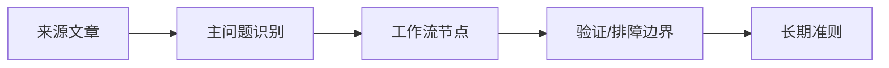

# uv远程脚本与工具链信任边界

## 来源
- [[09_电脑工具/0901_开发工具与CLI/090101_uv/文章/done-现在 uv 可以直接运行远程python脚本了|现在 uv 可以直接运行远程python脚本了]]

## 核心问题
`uv run` 远程脚本把一次性执行变得很方便，但也把网络来源、依赖声明、本机权限和可回放性放进同一个风险面。

## 判断准则
- 远程脚本只适合可信来源、固定版本或固定提交的场景；不能把可变 URL 直接写进长期自动化。
- 脚本如果会改文件、读凭据、联网或调用本机工具，必须先落成本地副本、审查依赖声明，再进入工作流。
- 单文件脚本依赖声明有利于复现，但仍要记录 Python 版本、缓存位置、网络失败和权限边界。

## 认知偏差
| 常见错误认知 | 正确理解 |
|---|---|
| 远程脚本省步骤，所以适合自动化 | 便利性扩大了供应链和本机权限风险，默认只能略读或人工确认 |
| 单文件脚本有依赖声明就可复现 | 还需要固定来源、Python 版本、外部服务和输出验收 |

## 架构/流程图（如有）

## 待验证缺口
- 补一个可信 URL、固定 commit、本地缓存和 hash 校验的最小脚本样例。
