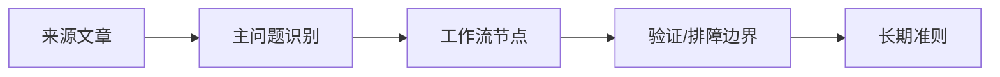

# 企业协作 CLI 权限与审计边界

## 来源
- [[09_电脑工具/0901_开发工具与CLI/090107_企业协作CLI/文章/done-x weixin - 让命令行的所有 Agent 任务进度和自动化流程皆可发微信|x weixin - 让命令行的所有 Agent 任务进度和自动化流程皆可发微信]]
- [[09_电脑工具/0901_开发工具与CLI/090107_企业协作CLI/文章/done-x-cmd v0.8.12：agent 部件化上线！weixin react 微信消息直接当命令跑！|x-cmd v0.8.12：agent 部件化上线！weixin react 微信消息直接当命令跑！]]
- [[09_电脑工具/0901_开发工具与CLI/090107_企业协作CLI/文章/done-企业微信 CLI 能做什么？我看完 GitHub 后，整理了最值得关注的 7 类能力|企业微信 CLI 能做什么？我看完 GitHub 后，整理了最值得关注的 7 类能力]]

## 核心问题
协作系统 CLI 一旦接入 Agent，就不只是通知工具，而是高权限的读消息、发消息、触发流程入口。

## 判断准则
- 读消息、发消息、改状态和触发流程要分权限级别，写操作默认需要显式审批或白名单。
- 任务进度通知适合自动化；代表用户发消息、读取群聊和执行命令必须记录调用来源、目标和结果。
- 企业微信/微信 CLI 的价值在把长任务状态带回用户，但不能绕过公司数据和隐私边界。

## 认知偏差
| 常见错误认知 | 正确理解 |
|---|---|
| 能发微信就是通知增强 | 真正风险是 Agent 获得协作系统写权限 |
| CLI 化后都可自动运行 | 写动作和读取敏感群聊必须审计 |

## 架构/流程图（如有）

## 待验证缺口
- 整理企业协作 CLI 的最小权限矩阵：只发自己、发群、读群、执行命令、上传文件。
