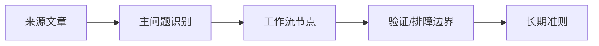

# Obsidian 发布同步与本地自动化边界

## 来源
- [[09_电脑工具/0902_文档与知识工具/090201_Obsidian/文章/done-Obsidian同步gitee，轻松搞定双同步|Obsidian同步gitee，轻松搞定双同步]]
- [[09_电脑工具/0902_文档与知识工具/090201_Obsidian/文章/done-Obsidian全能+写微信公众号文章|Obsidian全能+写微信公众号文章]]
- [[09_电脑工具/0902_文档与知识工具/090201_Obsidian/文章/done-Obsidian中配置PlantUML插件实现时序图渲染|Obsidian中配置PlantUML插件实现时序图渲染]]
- [[09_电脑工具/0902_文档与知识工具/090201_Obsidian/文章/done-如何把Obsidian Web Clipper价值最大化？|如何把Obsidian Web Clipper价值最大化？]]

## 核心问题
Obsidian 的发布、同步和图表插件把本地笔记连接到外部系统，关键风险是凭据、远端一致性、格式兼容和失败恢复。

## 判断准则
- Git/Gitee 同步要明确远端仓库、大小写、Token 权限、冲突处理和恢复方式。
- 发布到微信公众号这类外部平台时，草稿箱、图片、IP 白名单、AppID/AppSecret 都是独立验收项。
- PlantUML/Mermaid 类插件用于图表渲染时，要区分本地渲染依赖、线上兼容和导出效果。

## 认知偏差
| 常见错误认知 | 正确理解 |
|---|---|
| Obsidian 可以全能办公 | 越连接外部平台，越要审计凭据、格式和失败回滚 |
| 同步插件装好就万事大吉 | 冲突、大小写、Token、远端仓库权限都可能导致不可见失败 |

## 架构/流程图（如有）

## 待验证缺口
- 补 Obsidian Git/Gitee 同步冲突恢复和微信公众号发布失败回滚样例。
