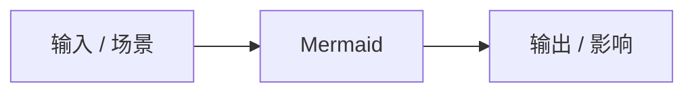

# Mermaid

## 知识点入口

- 本模块先看宏观流程，再看文章：[知识地图](090202_核心知识点/知识地图.md)。
- 新文章必须先归入流程节点，再判断是补充、冲突、不同层次还是降权。
- `文章/` 只保留原文锚点，长期知识必须沉淀到 `090202_核心知识点/`。

## 技术定位

| 项 | 内容 |
|---|---|
| 技术名 | Mermaid |
| 一级类目 | 电脑工具 |
| 二级类目 | 文档与知识工具 |
| 技术本体 | 后续精读时补证：围绕 `Mermaid` 的技术机制、工具能力、工程流程或主题边界 |
| 全局架构位置 | 后续补证 |
| 主要使用者 | 后续补证 |
| 主要产出 | 原文锚点、核心知识点、判断准则和后续追查动作 |

## 官方锚点

- 官网：后续补证
- GitHub：后续补证
- 官方文档：后续补证
- 架构文档：后续补证

## 架构图



## 排重准则

问题指纹：

```text
Mermaid + 所属模块 + 核心机制 + 解决问题 + 适用边界 + 对用户的认知增量
```

| 判断项 | 排重规则 |
|---|---|
| 只是在推荐工具或资讯 | 只保留原文锚点，不直接写核心知识点 |
| 有机制、边界或实践证据 | 可进入核心知识点候选 |
| 与已有主题重复 | 合并或追加原文，不新建重复笔记 |
| 目录或关键词误导 | 优先记录冲突点，再决定是否迁移 |

## 后续追查

- 先补技术本体、上下游、横向对标和适用边界。
- 再从 `文章/` 中筛选精读或实践文章进入 `090202_核心知识点/`。
